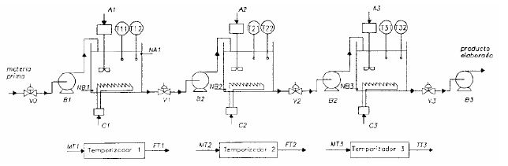

# Variante 1. Reactores discontinuos en serie

> Páginas 1–2 del PDF original (variante 1 en el documento original). Tareas a realizar: [00-tareas-generales.md](00-tareas-generales.md)

## Descripción del proceso

El proceso de elaboración de un producto consta de tres reactores discontinuos en serie, tal y como se describe en la figura anterior. Cada uno de los reactores dispone de dos sensores de temperatura (Ti1 y Ti2) y de un elemento calefactor que se activa mediante la señal Ci. El primero de los reactores dispone también de dos sensores de nivel, uno de nivel alto (NA1) y otro de nivel bajo (NB1), mientras que los otros reactores sólo cuentan con un sensor de nivel bajo (NBi). El primer reactor ha de llenarse hasta su nivel alto.

Una vez completada la reacción en cada uno de los reactores, el producto obtenido ha de descargarse al siguiente reactor. Para tal fin se dispone de las válvulas y bombas de trasiego indicadas en la figura, que se activan con las señales Vi y Bi respectivamente.

Para completar la reacción se debe mantener la temperatura del reactor entre Ti1 y Ti2 durante un tiempo determinado. Para ello se deben activar el calefactor (con la señal Ci) y el agitador (con la señal Ai) de cada uno de los reactores, hasta que se alcance la temperatura Ti2, momento en el que se apagará el calefactor y se deberá poner en marcha un temporizador activando la señal MTi. Cada vez que la temperatura sobrepase Ti2, el calefactor se apagará y permanecerá apagado hasta que la temperatura sea inferior a Ti1, momento en que se encenderá de nuevo.

El temporizador activa la señal FTi cuando se haya completado el tiempo de reacción asignado al temporizador de cada reactor. Una vez completada la reacción, y comprobado que el reactor siguiente está vacío, se procederá a descargar el producto abriendo las válvulas y activando las bombas apropiadas, hasta que se active la señal de nivel bajo indicando que el reactor está vacío.

## Requisitos de accionamiento

Las bombas 1, 2 y 4 son accionadas por arrancadores suaves; a la electrobomba 3 se le regulará el caudal con un convertidor de frecuencia.
