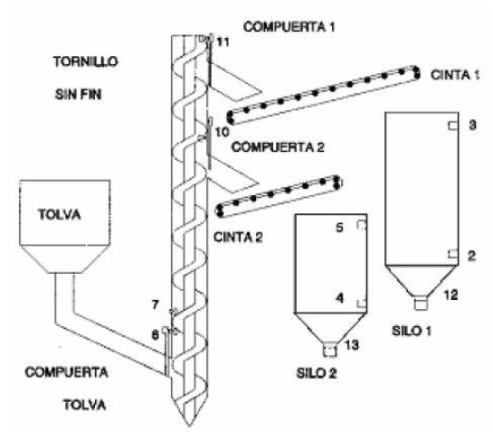

# Variante 2. Llenado de silos de cereales

> Páginas 2–3 del PDF original (variante 2 en el documento original). Tareas a realizar: [00-tareas-generales.md](00-tareas-generales.md)

## Elementos del proceso

El proceso cuenta con:

- Una tolva, cuyo cierre o apertura es controlada por una compuerta, que es accionada, a su vez, por un cilindro.
- Dos compuertas accionadas por un motor eléctrico, las cuales serán las encargadas de dar paso a los silos.
- Dos cintas transportadoras y dos silos con sus respectivas sondas de nivel, que indicarán cuándo están llenos y cuándo vacíos. Además, llevarán unos detectores de peso que nos permitirán saber en todo momento cuál es su capacidad.
- Un tornillo sin fin, accionado por un motor eléctrico.

## Secuencia a realizar

- Depósito 1 está vacío, o más vacío que el depósito 2, en cuyo caso se acciona la compuerta de la tolva y se conectará el tornillo sin fin.
- Cuando la compuerta de la tolva esté totalmente abierta, a los 10 segundos se conectará la cinta transportadora y se abrirá la compuerta 1.
- Cuando el detector de llenado del silo 1 se active, se cerrará la compuerta de la tolva.
- Una vez que la compuerta de la tolva esté totalmente cerrada, a los 6 segundos se parará el tornillo sin fin y se cerrará la compuerta 1.
- A los 15 segundos se parará la cinta 1 y se activará la luz de llenado.
- Parada de la cinta 1, se repite el proceso, pero con los elementos del silo 2.

La secuencia definida hasta ahora se cumplirá siempre que los dos silos se encuentren vacíos. Para llenarlos cuando no estén totalmente vacíos, se leen los detectores de peso, de manera que si deseamos llenar los silos, el autómata deberá comenzar siempre por el más vacío. La secuencia de llenado de cada silo es la misma que la definida anteriormente. Las luces de llenado sólo permanecerán encendidas mientras los silos estén completamente llenos.

## Descripción en detalle

La primera acción a realizar —una vez que se ha pulsado la puesta en marcha— es comparar cuál de los silos se encuentra más vacío, comenzando el ciclo por éste. En el caso de que los dos se encuentren vacíos, la secuencia será: primero se abre la compuerta de la tolva y se conecta al mismo tiempo el tornillo sin fin; se deja que transcurra un tiempo determinado antes de conectar la cinta 1 y abrir la compuerta 1. Cuando el silo 1 se ha llenado, se cerrará la compuerta de la tolva. Antes de pasar a las siguientes acciones se deja un tiempo para asegurar que la compuerta de la tolva se ha cerrado. Una vez transcurrido ese tiempo, se parará el tornillo sin fin y se cerrará la compuerta 1, dejando pasar un nuevo tiempo entre estas acciones y las siguientes. Una vez transcurrido este tiempo se para la cinta 1 y se enciende la luz de llenado del silo 1.

Una vez llenado el silo 1, se inicia el llenado del silo 2; el proceso es idéntico: se abre la compuerta de la tolva y se conecta el tornillo sin fin, temporización, se abre la compuerta 2 y se conecta la cinta 2, se cierra la compuerta de la tolva, se temporiza y se para el tornillo sin fin, cerrando la compuerta 2, de nuevo se temporiza y por último se enciende la luz de llenado del silo 2 y se para la cinta 2.

## Requisitos de accionamiento

El tornillo sinfín se accionará con un motor de dos velocidades, para adecuarlas al tipo de grano.
