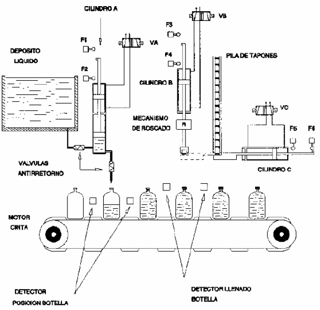

# Variante 3. Máquina de llenado y tapado

> Tareas a realizar: [00-tareas-generales.md](00-tareas-generales.md)

## Descripción del proceso

Se pretende regular un sistema de llenado y taponado de botellas, partiendo el proceso de botellas ya llenas listas para ser taponadas. Al conectar el sistema, el motor de la cinta inicia la marcha; éste parará cuando haya botellas en condiciones de ser llenadas y en condiciones de ser tapadas. Se pretende que al mismo tiempo que se llena una botella otra ya llena sea taponada.

Los elementos que se utilizan son:

- Un dosificador volumétrico regulable movido por el cilindro A.
- Dos válvulas antirretorno.
- Un transferidor de tapones, representado por el cilindro C.
- Un cilindro de avance B (cilindro de tres posiciones; cuando coge el tapón, permanece en esa posición hasta que el cilindro C termina su proceso de retirada), un motor neumático, encargado del roscado de los tapones mediante un giro de 270 grados.
- Seis finales de carrera.
- Un detector de posición y una fotocélula que indica el estado de las botellas (llenas y vacías).

## Descripción al detalle

Al activar el sistema, el motor de la cinta comienza a girar hasta que los detectores de posición para el llenado de botellas y el detector de botella llena para ser tapada se activan (ambos se activan al mismo tiempo debido a la configuración del sistema). Cuando esto ocurre, el cilindro A comienza a bajar, es decir, la botella vacía comienza a llenarse; el cilindro C comienza a salir hasta la posición en la que B cogerá el tapón y la cinta se para; todo esto ocurre simultáneamente.

Cuando las tres etapas anteriores se han cumplido, el cilindro B comienza a salir hasta que coge el tapón, momento en el cual se para (permaneciendo en esa posición) y simultáneamente el cilindro C comienza a retirarse; cuando el cilindro C termina su retirada, el cilindro B continúa su avance hasta llegar a la posición de roscado; en este punto el cilindro A, que ya debería haber llegado al final de su recorrido, inicia su movimiento de retroceso, al tiempo que el motor neumático inicia su movimiento de giro; cuando ha girado 270 grados, el cilindro B inicia su movimiento de retroceso. Cuando el cilindro B y A están en las condiciones iniciales se vuelve a empezar un nuevo ciclo.

Cuando se detecte que la botella para ser llenada no se encuentra totalmente llena se encenderá la luz de alarma y no se ejecutará ninguna etapa hasta que la botella sea sustituida por otra llena y se pulse el rearme.

## Requisitos de accionamiento

La cinta transportadora se accionará con un convertidor de frecuencia.
