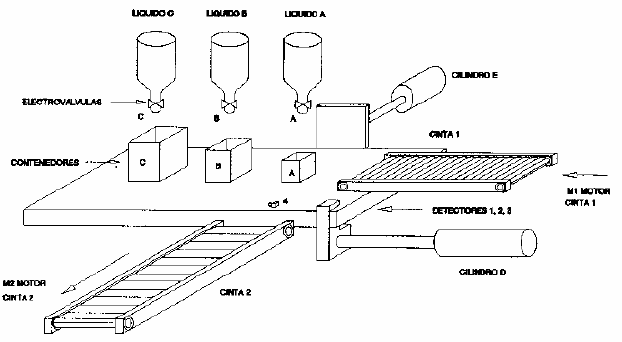

# Variante 4. Llenado de contenedores

> Tareas a realizar: [00-tareas-generales.md](00-tareas-generales.md)

## Elementos del proceso

El proceso que se describe en este caso cuenta con:

- Dos cilindros, uno de simple efecto (E) y otro de tres posiciones (D).
- Tres depósitos con sus respectivas electroválvulas.
- Dos cintas transportadoras.
- Una plataforma móvil impulsada por el cilindro D.
- Tres contenedores A, B y C.
- Tres detectores de posición que indicarán la posición que ocupan los contenedores A, B y C en la plataforma móvil; estos detectores ocuparán posiciones fijas por debajo de la plataforma, no desplazándose con ésta.
- Un final de carrera.

Se dispone de tres contenedores de diferentes tamaños A, B y C. Se pretende llenar los contenedores de la siguiente forma:

- Contenedor A: 15 segundos de líquido A.
- Contenedor B: 15 segundos de líquido B más 10 segundos de líquido A.
- Contenedor C: 15 segundos de líquido C, 10 segundos de líquido B y 5 segundos de líquido A.

El sistema constará de una cinta transportadora en la que van en serie los tres contenedores A, B y C. El primer recipiente en llegar a la plataforma será el C, a continuación el B y por último el A. El cilindro E se encarga de evacuar los recipientes y los coloca en la cinta de evacuación.

## Descripción al detalle

El proceso se inicia con la activación del contacto de marcha, siempre y cuando todos los detectores estén desactivados, y continuará hasta que se desactiven mediante el pulsador de parada (alimentación). La primera acción a realizar es la activación de la cinta 1, que estará activa hasta que el contenedor C esté sobre la plataforma; en ese momento la cinta 1 se parará y el cilindro D avanzará una posición; cuando el contenedor C active el detector 2, la cinta 1 se activará de nuevo y el cilindro D se parará; la cinta 1 se parará cuando el contenedor B esté sobre la plataforma y por consiguiente se active el detector de posición 1; al mismo tiempo se activará el cilindro D; el cilindro D se parará de nuevo cuando el contenedor C active el detector 3 y el B el detector 2 y al mismo tiempo que se para D se activa la cinta 1; cuando el contenedor A esté en la plataforma, se parará la cinta 1.

Cuando ésta esté parada, se activará el temporizador cero (esta operación se realiza para sincronizar la apertura de las electroválvulas y asegurar que las válvulas estén abiertas al mismo tiempo); cuando el temporizador ha contado 5 segundos se abren simultáneamente las tres válvulas, que estarán abiertas durante 15 segundos; se cierran a continuación las válvulas y se activa el cilindro de evacuación E; cuando el cilindro E llegue al detector 4 y las válvulas estén cerradas se pasa a activar la cinta 2 y el retroceso del cilindro E; cuando el cilindro E esté desactivado, se activa el retroceso del cilindro D.

Cuando se activen los detectores 1 y 2 se para el cilindro D y a continuación se activa el temporizador 1 (con la misma función que el 0); cuando lleve activo 5 segundos, se abren las válvulas A y B, que estarán abiertas durante 10 segundos, al cabo de los cuales se cerrarán y se activará el cilindro E; cuando el cilindro E llegue al detector 4 y las válvulas estén cerradas, se hará retroceder el cilindro E hasta su posición de reposo y a continuación se activará el retroceso de D hasta la posición 1. Una vez en esta posición se parará y a continuación se activará el temporizador 2; a los 5 segundos se cerrará y se activará el cilindro E; cuando el cilindro E llegue al detector 4 y la válvula A esté cerrada, se activará el retroceso de E hasta que éste llegue a su posición de reposo; a continuación se parará la cinta 2 y se estará en condiciones de iniciar el ciclo de nuevo.

## Requisitos de accionamiento

Las cintas transportadoras se accionarán con un convertidor de frecuencia.
