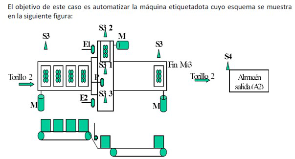

# Variante 5. Máquina etiquetadora

> Tareas a realizar: [00-tareas-generales.md](00-tareas-generales.md)

## Descripción del proceso

El objetivo de este caso es automatizar la máquina etiquetadora cuyo esquema se muestra en la siguiente figura:

El Torillo_2 se debe encargar de la introducción de botellas en la cinta transportadora 1, cuyo movimiento se activa a través del motor M1. La introducción de una caja de botellas hace que se active el sensor S3, tras lo cual se debe poner en marcha el motor M1 durante 10 segundos (temporizador TM1). Inicialmente (cuando se pulse el pulsador de marcha general PM), el Torillo_2 debe introducir cajas en la cinta M1 y activar su movimiento hasta que se introduzcan 5 cajas (utilizando un contador C1).

Una vez introducidas 5 cajas, habrá cuatro en la cinta 1 y la primera introducida habrá caído por gravedad a la segunda cinta (transversal), cuyo movimiento se gobierna por el motor M2, activando el sensor S3_1. La cinta deberá moverse en primer lugar hacia la derecha hasta que se active el sensor S3_2, que indicará que la caja se encuentra en uno de sus extremos. Una vez allí, se deberá activar el pistón E1 que permite estampar la etiqueta en la caja y activar también el pistón P durante 5 segundos (temporizador TM2) que permite expulsar una caja desde la posición indicada por S3_1 hasta la tercera cinta transportadora (en el primer ciclo no habrá caja).

A continuación, se activará el motor M1 (durante los mencionados 10 segundos) para permitir que caiga otra caja en la posición S3_1 procedente de la cinta 1, decrementando el contador de cajas en cinta 1. A continuación la cinta 2 (M2) se moverá hacia la izquierda hasta que la nueva caja llegue a la posición indicada por el sensor S3_3, procediendo en ese momento a la activación del pistón E2 que estampará la etiqueta y a la activación del pistón P durante 5 segundos que expulsará la caja ya etiquetada a la cinta 3. A continuación, se permitirá al Torillo_2 que introduzca una caja nueva en la cinta 1 y la activación del motor de la cinta 1 (M1) durante 10 segundos para permitir que caiga una nueva caja en la posición dada por S3_1, repitiendo el ciclo completo.

La tercera cinta, gobernada por el motor M3, estará siempre en movimiento hasta que se active el sensor S3_4 que indica que una caja ha llegado hasta el final de la misma y hay que pararla, momento en el cuál además se activará una señal Fin_Ma3 para que el Torillo_2 pueda llevar la caja hasta el almacén de salida (A2), activando el sensor S4 a su llegada, que indica que se ha liberado el Torillo_2. Una vez que S3_4 no detecta caja, la cinta M3 seguirá girando.

## Requisitos de accionamiento

Las cintas transportadoras se accionarán con un convertidor de frecuencia. Torillo = montacarga.
