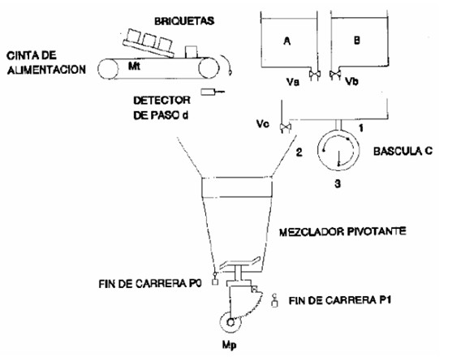

# Variante 6. Dosificador mezclador automático

> Páginas 8–9 del PDF original (variante 6 en el documento original). Tareas a realizar: [00-tareas-generales.md](00-tareas-generales.md)

## Descripción del proceso

Un mezclador pivotante recibe los productos A y B pesados por la báscula C y briquetas solubles llevadas una a una por una cinta de alimentación. El automatismo permite realizar una mezcla que contiene los tres productos. Se cuenta por tanto con:

- Un mezclador pivotante.
- Dos contenedores con diferentes sustancias.
- Una báscula.
- Una cinta transportadora que suministrará briquetas solubles.
- Los elementos de control necesarios para la ejecución del problema.

El ciclo a realizar será el siguiente: la acción sobre el botón de alimentación provoca la pesada y alimentación de los productos de la siguiente forma:

- Pesada del producto A, hasta la referencia 1.
- Pesada del producto B, hasta la referencia 2.
- A continuación, vaciado de la báscula C en el mezclador.
- Alimentación de dos briquetas.

El ciclo se termina con la rotación del mezclador y su pivotamiento al cabo de un tiempo t, manteniéndose la rotación del mezclador durante el vaciado.

## Descripción al detalle

Al accionar el pulsador de alimentación, la primera acción a realizar será la pesada del producto A. Una vez concluida ésta, se realizan tres acciones simultáneas que son: cierre de Va, pesada del producto B y la alimentación de dos briquetas. Cuando estas acciones han terminado se puede pasar al vaciado de la báscula. Una vez vaciada se ejecutan dos acciones simultáneas, que son el cierre de la válvula Vc y la puesta en marcha del mezclador. Transcurrido el tiempo necesario para la mezcla, se puede iniciar el vaciado del mezclador; cuando esta acción ha concluido, se para el motor de giro a la derecha, el motor del mezclador y se inicia el giro a izquierdas; cuando el mezclador ha recuperado su posición se para el motor de giro a izquierdas y se vuelve al inicio.
