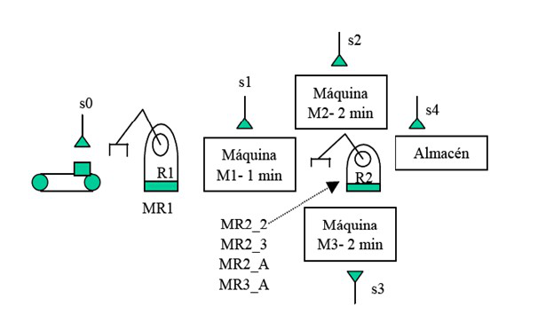

# Variante 7. Célula de fabricación flexible

> Páginas 9–10 del PDF original (variante 7 en el documento original). Tareas a realizar: [00-tareas-generales.md](00-tareas-generales.md)

## Descripción del proceso

Se desea programar un autómata que gobierne el funcionamiento de una célula de fabricación flexible. Como se observa en la figura, la célula está compuesta por: una cinta de alimentación de material, dos robots R1 y R2 para transporte de piezas, tres máquinas de transformación de piezas y un almacén.

La presencia de pieza en la cinta de alimentación se detecta mediante el sensor s0. Si el robot R1 está libre, existe pieza en la cinta y no hay ninguna pieza en la máquina 1, se activará el motor del robot MR1 para que lleve la pieza de la cinta a la máquina 1. La llegada y presencia de pieza en la máquina 1 se detectará mediante el sensor s1. Una vez depositada la pieza en la máquina 1, habrá que activar el motor M1 de dicha máquina y tenerlo funcionando durante 1 minuto.

Una vez finalizado el procesamiento en la máquina 1, el robot R2 será el encargado de transportar la pieza a la máquina 2 ó 3 (la que esté libre en ese momento, si es que hay alguna libre). Para transportar la pieza de la máquina 1 a la 2 se activará una señal MR2_2. Para transportar la pieza de la máquina 1 a la 3 se activará una señal MR2_3. La llegada y presencia de piezas en las máquinas 2 y 3 se detecta mediante los sensores s2 y s3 respectivamente.

Una vez depositada la pieza en la máquina 2, se activará su motor correspondiente M2 durante 2 minutos (lo mismo se aplica para la máquina 3 activando el motor M3 durante 2 minutos). Una vez finalizado el procesado en alguna de las dos máquinas y si el robot R2 está libre, se procederá a su traslado al almacén, activando las señales MR2_A si es de la máquina 2 al almacén o MR3_A en el caso de traslado de la máquina 3 al almacén. La llegada y presencia de pieza en el almacén se reconoce mediante la activación del sensor s4.

Por tanto, las cuatro maniobras posibles del robot R2 se denotan mediante (MR2_2, MR2_4, MR2_A, MR3_A).
