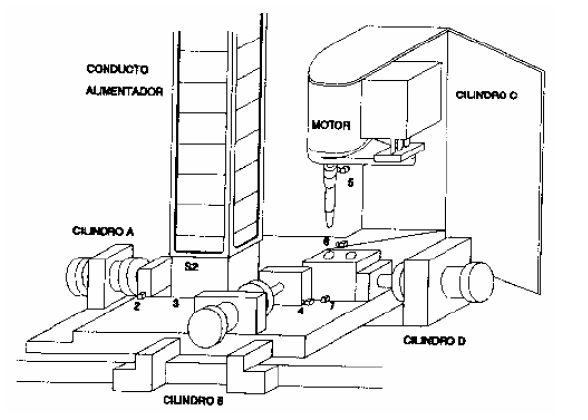
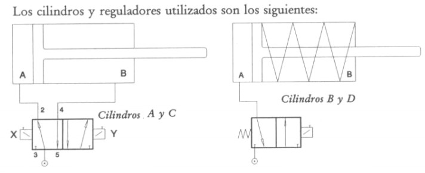

# Variante 8. Taladradora automática

> Páginas 10–11 del PDF original (variante 8 en el documento original). Tareas a realizar: [00-tareas-generales.md](00-tareas-generales.md)

## Elementos del proceso

Este proceso cuenta con lo siguiente:

- Dos cilindros de doble efecto (A y C).
- Dos cilindros de simple efecto (B y D).
- Seis finales de carrera (2, 3, 4, 5, 6 y 7).
- Un detector de posición (S2).
- Motor broca.

## Descripción del proceso

Las piezas se almacenan en un conducto alimentador. Si se detecta la presencia de una pieza en el conducto alimentador (S2 activado), se hace salir el cilindro A, que introduce la pieza en el dispositivo de sujeción. Después de haber quedado bloqueada mediante los cilindros B y D (éste en posición de reposo), la broca gira (motor broca) y comienza a descender (sale el cilindro C); al terminar el primer taladrado, el cilindro C se retira a su posición inicial. Seguidamente se libera la pieza y el cilindro D la sitúa para el segundo taladrado; la pieza se vuelve a fijar con el cilindro B y el D (en posición 2); se repite el proceso de taladrado; al finalizar, el cilindro C regresa a su posición alta, el motor de la broca se para. El cilindro B libera la pieza y el D regresa a su posición inicial. La pieza puede ser retirada del sistema.

El sistema cuenta con un paro de emergencia, que entrará en funcionamiento siempre que el detector S2 no esté activado. La siguiente figura ilustra el proceso:

Los cilindros y reguladores utilizados son los siguientes:

## Descripción en detalle

El proceso comienza cuando todos los cilindros se encuentran en posición de reposo y el detector S2 activado. La primera acción a realizar es el avance del cilindro A, hasta que llega al final de carrera 2. Cuando llega a este punto retrocede, hasta llegar al final de carrera 1. Cuando el cilindro A ha terminado su retroceso, sale el cilindro B hasta llegar a 4. Cuando la pieza está sujeta, el motor de la broca se conecta y el cilindro C comienza a bajar.

Cuando el cilindro C llega al final de carrera 6, se libera la pieza (retroceso del cilindro B) y retrocede el cilindro C. Una vez que el cilindro C llega al final de carrera 5, los cilindros B y D comienzan a salir para fijar la pieza para el segundo taladrado. Una vez que la pieza ha sido fijada (cilindros tocando finales de carrera 4 y 7), el cilindro C sale de nuevo hasta llegar a la posición 6, a partir de la cual el motor de la broca se para y los cilindros B, D y C inician su retroceso. Llegado este punto, el sistema se encuentra en condiciones de iniciar un nuevo ciclo, siempre y cuando el detector S2 se encuentre activado.

## Requisitos de accionamiento

El motor de la broca se accionará con un convertidor de frecuencia.
