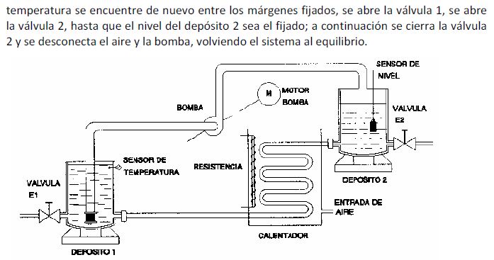

# Variante 9. Control de temperatura de un líquido

> Páginas 12–13 del PDF original (variante 9 en el documento original). Tareas a realizar: [00-tareas-generales.md](00-tareas-generales.md)

## Elementos del proceso

Se trata de mantener la temperatura de un líquido entre dos márgenes determinados (60 y 65 ºC) y de que el nivel en los depósitos mantenga una determinada capacidad. El proceso cuenta con:

- Dos depósitos de líquido.
- Dos válvulas, con dos sensores de posición cada una, que indicarán la situación de las válvulas.
- Dos sensores: uno de temperatura y otro de nivel de líquido.
- Un grupo calefactor, formado por un serpentín y una resistencia.
- Una bomba, con su correspondiente motor.
- Un equipo de bombeo de aire.

Si la temperatura se encuentra dentro de los márgenes fijados, la válvula 1 se abrirá, y la válvula 2 se abrirá hasta que el depósito 2 alcance la capacidad fijada; cuando la alcance, la válvula 2 se cerrará y permanecerá así hasta que el líquido contenido en el depósito 2 se encuentre por debajo del límite fijado.

Cuando la temperatura salga de los márgenes de temperatura fijados, las válvulas de entrada y de salida se cerrarán (independientemente de que el depósito 2 esté recuperando su nivel) y permanecerán cerradas hasta que la temperatura sea la fijada. Siempre predominará la variable temperatura con respecto a la variable de nivel de líquido.

## Descripción en detalle

Cuando la temperatura es menor de 60 grados y el depósito 2 está lleno, se cierra la válvula 1 y se cierra la válvula 2, se activa la resistencia calefactora y se conecta la bomba. Cuando la temperatura es la fijada, se abren las válvulas 1 y la 2. También se desconecta la resistencia calefactora y la bomba volviendo el sistema al equilibrio.

Cuando la temperatura permanece entre los márgenes fijados y el depósito 2 pierde el nivel fijado, se abrirá la válvula 2 hasta que se recupere el nivel fijado; si la temperatura se mantiene durante el llenado del depósito 2, se pasa al cierre de la válvula 2; si la temperatura disminuye por debajo de los 60 grados se repite el proceso anteriormente descrito para esta eventualidad.

Si la temperatura es superior a 65 grados, se cerrarán las válvulas 1 y 2, se conectará la bomba y el aire. Cuando la temperatura se encuentre de nuevo entre los márgenes fijados, se abre la válvula 1, se abre la válvula 2, hasta que el nivel del depósito 2 sea el fijado; a continuación se cierra la válvula 2 y se desconecta el aire y la bomba, volviendo el sistema al equilibrio.

## Requisitos de accionamiento

El motor de la bomba se accionará con ayuda de un arrancador suave.
