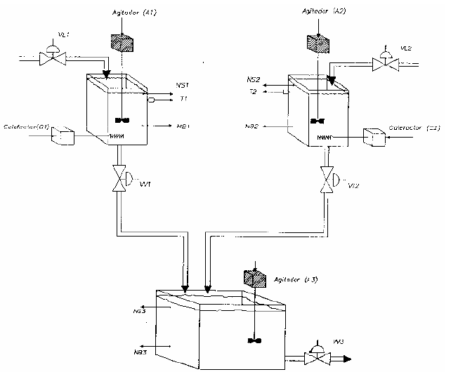

# Variante 10. Tanques de agitación

> Páginas 13–14 del PDF original (variante 10 en el documento original). Tareas a realizar: [00-tareas-generales.md](00-tareas-generales.md)

## Descripción del proceso

Considérese un sistema compuesto por tres tanques tal y como se describe en la siguiente figura. En primer lugar se abren las válvulas de llenado (VL1 y VL2) de los tanques superiores D1 y D2 para que se llenen con los productos S1 y S2 respectivamente, hasta que los sensores de nivel superior correspondientes (NS1 y NS2) estén activados.

A continuación se calientan hasta que sus temperaturas alcancen el valor de consigna, manteniendo el agitador correspondiente funcionando (A1=1, A2=1). En ese momento (cuando los dos tanques han alcanzado sus temperaturas respectivas de referencia), los productos se descargan en el tanque D3 abriendo las válvulas de vaciado (VV1 y VV2) de cada depósito y se agita hasta que los dos depósitos hayan terminado de vaciarse, lo cual es detectado porque se activan los sensores de nivel bajo correspondientes (NB1 y NB2).

En ese momento se debe abrir la válvula de vaciado (VV3) del tanque D3, que debe permanecer abierta hasta que se active la señal de nivel bajo correspondiente y empezar un nuevo ciclo.

