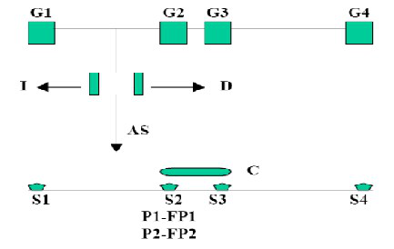

# Variante 11. Automatización del trabajo de una grúa

> Páginas 14–15 del PDF original (variante 11 en el documento original). Tareas a realizar: [00-tareas-generales.md](00-tareas-generales.md)
>
> Nota: en el documento original no existe la variante 12 (la numeración saltaba de la 11 a la 13); aquí se ha renumerado de forma secuencial.

## Descripción del proceso

La figura muestra una instalación donde se dispone de una grúa aérea para transporte de material. La grúa se gobierna desde un autómata programable (AP) a través de tres señales que hacen que se desplace hacia la izquierda (I), derecha (D) y que realice una maniobra de agarre/suelta de pieza (AS). Cada vez que se ordena la maniobra mediante una salida, el AP activa un temporizador de 20 segundos. Cuando el temporizador termina indica que la maniobra ha terminado. En sus desplazamientos la grúa se puede detener en cuatro posiciones G1, G2, G3 y G4, donde hay sensores fin de carrera que indican al AP que la grúa ha llegado a dicha posición.

En la nave hay cuatro secciones donde se manipula material. La presencia de material en cada una de las secciones se indica por un sensor correspondiente (S1, S2, S3 y S4). El procesamiento en cada sección es el siguiente:

- **Secciones 1 y 3:** cuando haya material (S1 y/o S3 activo), el AP debe ordenar un desplazamiento de la grúa a G1 ó G3, ordenar una maniobra de agarre/suelta (con temporizado correspondiente), desplazar el material a G2 ó G4 respectivamente y ordenar de nuevo una maniobra de agarre/suelta (con temporizado correspondiente). Si hay pieza simultáneamente en S1 y S3 tendrá prioridad el desplazamiento de la que se encuentre en S3.
- **Sección 2:** cuando se detecte material en S2, el AP activará dos procesos P1 y P2 (a través de dos salidas). Una vez finalizados los procesos, cada uno activa un fin de carrera (FP1, FP2 respectivamente). Cuando los dos finales de carrera estén activados, el AP mandará una señal C para activar una cinta transportadora que transportará el material hasta que se active S3.
- **Sección 4:** cuando se detecta pieza en S4, el AP activa una luz para que retiren el material e incrementará un contador del número de piezas.

La operación diaria se inicia con un pulsador de marcha (PM).

## Requisitos de accionamiento

La grúa es operada por un motor de rotor bobinado y la estera con un motor de inducción al que debe regulársele la velocidad. Las esteras se accionan con un convertidor de frecuencia.
