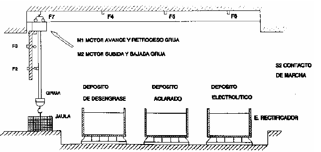

# Variante 12. Proceso de electrólisis

> Página 16 del PDF original (variante 13 en el documento original). Tareas a realizar: [00-tareas-generales.md](00-tareas-generales.md)

## Elementos del proceso

El proceso que se va a describir a continuación consiste en el procedimiento para el tratamiento de superficies, con el fin de hacerlas resistentes a la oxidación. Para la realización del proceso se cuenta con:

- Dos motores de doble sentido de rotación, uno para el movimiento vertical de la grúa y otro para el movimiento transversal.
- Seis finales de carrera.
- Un contacto de inicio de ciclo.

El sistema constará de tres baños:

- Uno para el desengrasado de las piezas.
- Otro para el aclarado de las piezas.
- Un tercero donde se les dará el baño electrolítico.

La grúa introducirá la jaula portadora de las piezas a tratar en cada uno de los baños, comenzando por el de desengrasado, a continuación en el de aclarado y por último les dará el baño electrolítico; en este último, la grúa debe permanecer un tiempo determinado para conseguir una uniformidad en la superficie de las piezas tratadas.

## Descripción al detalle

El ciclo se inicia al pulsar el contacto de marcha; la primera acción a realizar es la subida de la grúa; cuando toca el final de carrera F3, la grúa comenzará a avanzar, hasta llegar al final de carrera F4, en dicho punto la grúa desciende; una vez que toca el final de carrera F2, la grúa vuelve a ascender hasta tocar de nuevo el final de carrera F3, momento en el cual la grúa vuelve a avanzar, hasta alcanzar la posición de F5, momento en el cual se repiten los movimientos de descenso y ascenso de la grúa.

Cuando la grúa está de nuevo arriba avanza hasta F6, vuelve a bajar y cuanto toca F2 se conecta el proceso de electrólisis. Cuando ha pasado el tiempo fijado, se desconecta el proceso de electrólisis y la grúa comienza a ascender hasta que toca a F3. Al llegar a este punto, la grúa inicia el movimiento de retroceso, hasta llegar al final de carrera F7, momento en el cual volverá a descender hasta activar el final de carrera F2.

## Requisitos de accionamiento

Los motores de la grúa son de rotor bobinado y jaula de ardilla.
