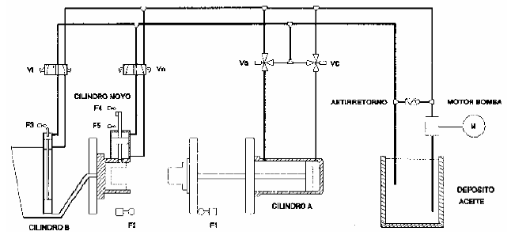

# Variante 13. Maniobra para prensa de fundición inyectada

> Tareas a realizar: [00-tareas-generales.md](00-tareas-generales.md)

## Descripción del proceso

Se dispone de una máquina para prensa de fundición inyectada que debe realizar el siguiente ciclo: cierre del molde; dosificar el plástico fundido a inyectar; inyección del plástico; pausa para que no queden burbujas de aire en la pieza; entrar noyos para configurar pieza; pausa para permitir la solidificación; abrir noyos; abrir molde y expulsión de la pieza antes de comenzar un nuevo ciclo.

Para la realización se cuenta con los siguientes elementos:

- Cinco finales de carrera.
- Tres cilindros neumáticos.
- Una bomba hidráulica con su correspondiente motor.

## Descripción al detalle

Al comenzar el ciclo se conecta la bomba. Una vez que ésta ha sido conectada, el molde se cierra mediante el avance del cilindro A. Cuando el molde se encuentra cerrado, se dosifica el plástico a inyectar mediante el cilindro B; cuando el material ha sido dosificado gracias a la subida del cilindro B, el plástico comienza a ser inyectado mediante la bajada del cilindro B.

Cuando el cilindro ha llegado a su posición de reposo, hay que esperar un tiempo para permitir que el aire salga del molde, y a continuación introducir los noyos mediante el cilindro C. En este punto se para el ciclo para permitir la solidificación de la pieza. Transcurrido el tiempo que se considera necesario, se pasa a retirar el molde y también los noyos. Cuando estas acciones han concluido se puede iniciar un nuevo ciclo.

## Requisitos de accionamiento

La electrobomba se accionará con un arrancador suave.
