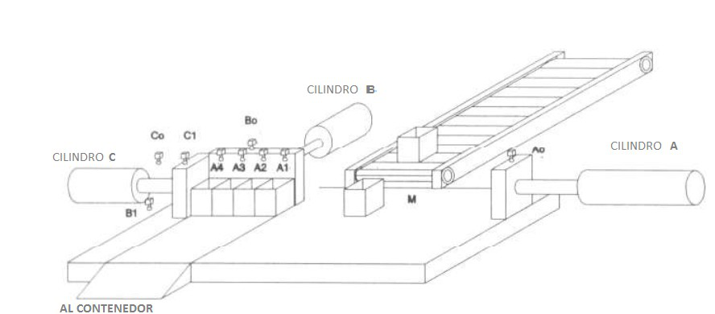
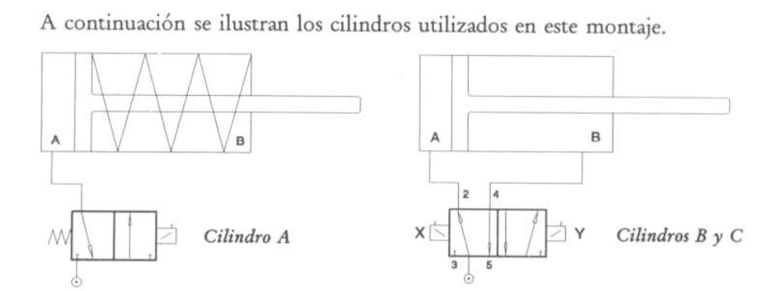

# Variante 14. Apiladora

> Tareas a realizar: [00-tareas-generales.md](00-tareas-generales.md)

## Descripción del proceso

El sistema consta de tres cilindros A, B y C.

En el recorrido del vástago del cilindro A existen 5 finales de carrera: A0, A1, A2, A3, A4.

Los cilindros B y C cuentan sólo con dos finales de carrera.

Un impulso suministrado por un sensor M hace salir el vástago del cilindro A hasta el captador A4, y a continuación retroceder. El sensor M, que detectará la presencia de las piezas, sólo dará un impulso cuando, además de existir alguna pieza, el vástago del cilindro A esté accionando el captador A0.

- Un segundo impulso de M hace salir a A hasta A3, y seguidamente retroceder hasta A0.
- Un tercer impulso en M hace salir a A hasta A2, y seguidamente retroceder.
- Un cuarto impulso de M hace salir a A hasta A1, y seguidamente retroceder.

Cuando A llega al captador A0 después del cuarto recorrido, ya no vuelve a salir, pero da la orden de retroceso del vástago del cilindro C.

Al llegar C al captador C0, ordena la salida del vástago del cilindro B, el cual retrocede al llegar al captador B1.

Al llegar B al captador B0, ordena la salida de C, que se para al llegar al captador C1, terminándose así el ciclo.

A partir de este momento, se iniciaría un nuevo ciclo si el sensor M sigue enviando información.

En la siguiente figura se ilustra el proceso:

## Requisitos de accionamiento

La estera se mueve con ayuda de un motor con velocidad regulada.
