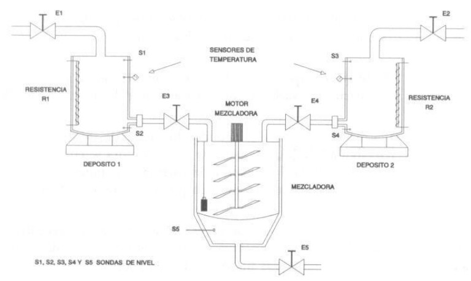

# Variante 15. Mezcladora de líquidos

> Tareas a realizar: [00-tareas-generales.md](00-tareas-generales.md)

## Elementos del proceso

Para la realización del siguiente problema contaremos con:

- Cinco electroválvulas, dos de doble efecto y tres de simple efecto. E1 y E2 serán de doble efecto; esto quiere decir que necesitan una señal del autómata tanto para abrir como para cerrar; el resto sólo necesitan la señal para abrir.
- Dos resistencias calefactoras.
- Una mezcladora.
- Dos depósitos con los líquidos a mezclar.
- Los elementos de control que se consideren necesarios.

## Descripción del proceso

Cuando pulsemos el contacto de marcha se abrirán las electroválvulas de doble efecto E1 y E2. Cuando por medio de las sondas de nivel se detecte que los depósitos están llenos, se cerrarán las electroválvulas.

Cuando las electroválvulas estén cerradas, se conectarán las resistencias calefactoras; cuando los depósitos alcancen las temperaturas fijadas, se desconectarán las resistencias y se verterán sus contenidos en la mezcladora.

Una vez vacíos los depósitos de líquido, se conectará la mezcladora, que permanecerá conectada 5 segundos, al cabo de los cuales su contenido será vaciado al exterior.

Tan pronto como la mezcladora se quede vacía, estaremos en condiciones de iniciar un nuevo ciclo.

En la siguiente figura se muestra el proceso a automatizar:

