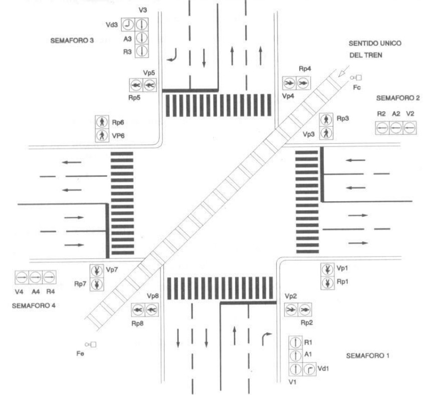

# Variante 16. Cruce de calles y vía férrea en diagonal regulada por semáforo

> Tareas a realizar: [00-tareas-generales.md](00-tareas-generales.md)

## Elementos del proceso

Para la realización de este problema contaremos con:

- 12 semáforos dispuestos tal y como se muestra en la figura.
- Dos finales de carrera (Fc y Fe).

## Descripción del proceso

En condiciones normales (sin paso de tren), ambas direcciones se alternan regularmente de acuerdo con el esquema.

Cuando el tren activa el final de carrera de entrada, los semáforos pasarán al estado lógico de permitir el paso del tren. Al mismo tiempo se podrá:

- Cruzar los peatones los pasos.
- Girar los coches a la derecha.

Activando el final de carrera de salida, continuará el ciclo pasados 15 segundos.

Al activar el final de carrera de entrada, si los semáforos de una dirección están en verde deberán pasar a ámbar, en vez de directamente a rojo.

El sistema llevará incorporado el modo de funcionamiento de noche, esto es, todos los semáforos en ámbar.

El tren siempre tiene prioridad de paso.

En la siguiente figura se ilustra el proceso a automatizar:

## Nota sobre el ciclo principal

El ciclo principal se desarrolla de la siguiente forma, si no se produce paso del tren durante su ejecución.

- **E0:** semáforos 4 y 2 en verde; semáforos de peatones 2, 4, 5, 8 en verde; semáforos 1 y 3 en rojo, y semáforos de peatones 1, 3, 6, 7 en rojo.
- **E1:** transcurrido el tiempo de ejecución de E0 pasamos a E1: semáforos 4 y 2 en ámbar; semáforos de peatones 2, 4, 5, 8 en verde; semáforos 1 y 3 en rojo; semáforos de peatones 1, 3, 6, 7 en rojo, y semáforos de giro a la derecha en ámbar.
