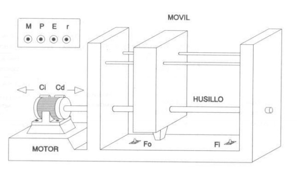

# Variante 17. Movimiento de vaivén de un móvil

> Tareas a realizar: [00-tareas-generales.md](00-tareas-generales.md)

## Elementos del proceso

Para la realización de este problema contaremos con los siguientes elementos:

- Un motor de doble sentido de giro.
- Un móvil situado sobre unos raíles y unido al motor mediante un tornillo sin fin.
- Dos finales de carrera.

## Descripción del proceso

Un móvil se desliza por un husillo movido por un motor de doble sentido de giro (para lo cual llevará un contactor Cd que le conexiona para que gire a derechas y otro Ci para giro a izquierdas). El móvil debe realizar un movimiento de vaivén continuado desde el momento en que el sistema reciba la orden impulsional de puesta en marcha (M).

Un impulso de parada sobre el actuador manual de parada (P) debe detener el motor, pero no en el acto, sino al final del movimiento de vaivén ya iniciado.

Un impulso procedente del mando de emergencia (E) debe producir el retroceso inmediato del móvil a la posición de origen, y el sistema no podrá ponerse en marcha de nuevo con el mando (M), si previamente no se ha accionado el pulsador de rearme (r).

En la siguiente figura se ilustra el proceso que deseamos automatizar:

