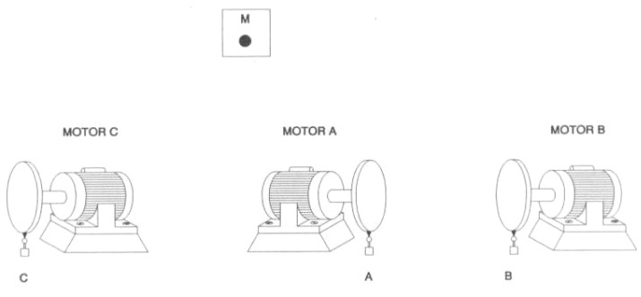

# Variante 18. Control de giro de varios motores

> Página 22 del PDF original (variante 19 en el documento original). Tareas a realizar: [00-tareas-generales.md](00-tareas-generales.md)

## Elementos del proceso

Para la realización de este problema contaremos con:

- Tres motores.
- Tres volantes acoplados a los motores: los volantes a su vez llevarán incorporadas unas levas.
- Tres captadores de información.

## Descripción del proceso

El autómata debe cumplir el programa siguiente: el accionamiento de un pulsador de puesta en marcha M hace que se ponga en funcionamiento el motor A (cualquiera que sea la posición de las levas). Cuando la leva del motor A accione por primera vez el interruptor *a*, se desconecta este motor y se ponen en funcionamiento los motores B y C. En el momento en que sea accionado el interruptor *b*, se desconectará el motor B y se pondrá en funcionamiento el motor A. A partir de este momento, cuando sea accionado *c* se desconectarán A y C, terminando el ciclo, hasta nueva orden de M.

La pulsación o persistencia de M durante el ciclo no deberá provocar efecto alguno; sólo será activa al principio del mismo.

En este sistema las variables *a*, *b* y *c* son aleatorias, pues al no estar sincronizadas las velocidades de los motores A, B y C no quedan determinados los instantes de la secuencia en los que se van a accionar los interruptores. Por tanto, pueden presentarse estados transitorios que se deberán tener en cuenta.

A continuación se muestra el dibujo que ilustra el proceso:

## Requisitos de accionamiento

Los motores deben tener la posibilidad de trabajar a varias velocidades.
