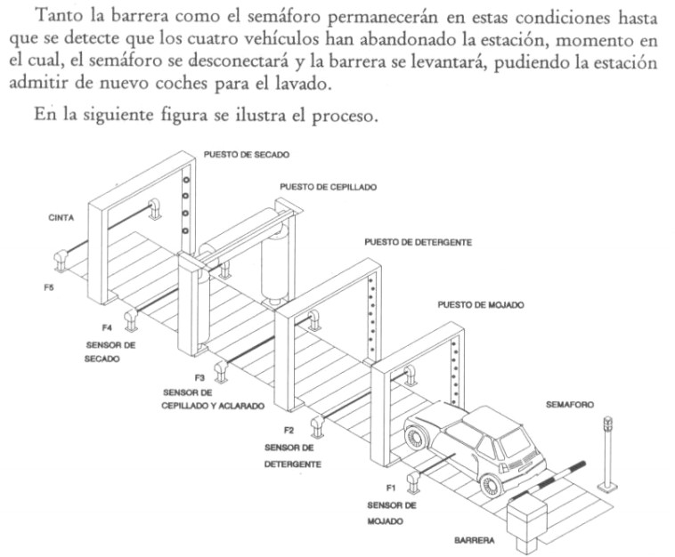

# Variante 19. Estación automática de lavado de vehículos

> Páginas 22–23 del PDF original (variante 20 en el documento original). Tareas a realizar: [00-tareas-generales.md](00-tareas-generales.md)

## Elementos del proceso

Para la realización de este problema contaremos con cinco células fotoeléctricas, un semáforo con dos luces alternativas, una barrera de paso, una cinta transportadora, un puesto para el mojado de vehículos, otro para el detergente, un tercero para el cepillado y el aclarado y por último otro para el secado.

## Descripción del proceso

La barrera, en condiciones normales, deberá estar levantada y el semáforo desactivado. Cuando en la estación se detecte que hay 4 vehículos, uno en cada puesto, la barrera deberá bajar y el semáforo se activará, indicando que no se puede pasar.

Tanto la barrera como el semáforo permanecerán en estas condiciones hasta que se detecte que los cuatro vehículos han abandonado la estación, momento en el cual, el semáforo se desconectará y la barrera se levantará, pudiendo la estación admitir de nuevo coches para el lavado.

En la siguiente figura se ilustra el proceso:

