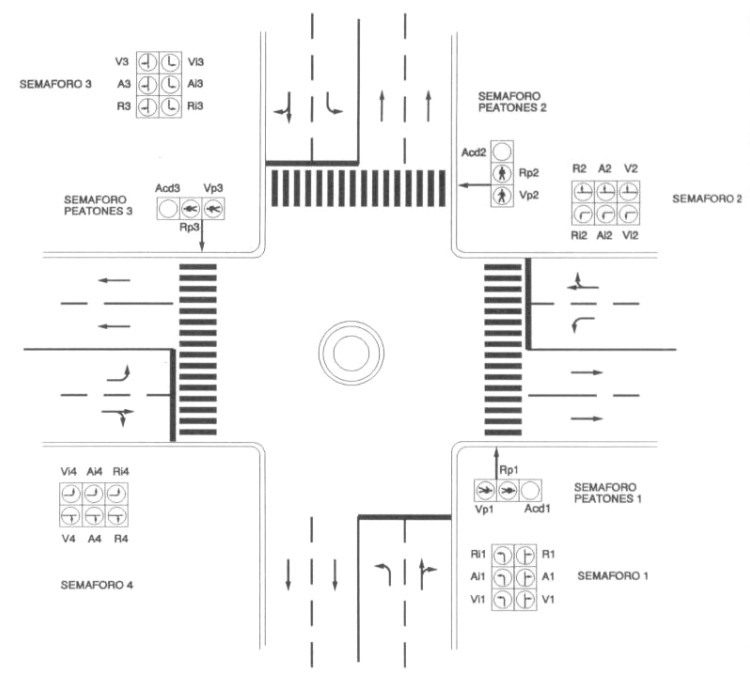

# Variante 20. Regulación automática de un cruce de semáforos

> Tareas a realizar: [00-tareas-generales.md](00-tareas-generales.md)

## Descripción del proceso

El sistema regula automáticamente el cruce de dos calles perpendiculares, en las que se permite circulación en ambos sentidos, así como giros a derechas e izquierdas de una calle a otra.

Para la realización del control del cruce se ha dispuesto de siete semáforos, distribuidos tal y como se muestra en la siguiente figura.

