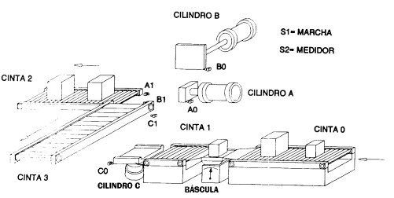

# Variante 21. Elevador clasificador para paquetes

> Tareas a realizar: [00-tareas-generales.md](00-tareas-generales.md)

## Elementos del proceso

Para la realización del programa tenemos:

- Cuatro finales de carrera (A0, A1, B0, B1).
- Dos detectores de posición (C0, C1).
- Tres cilindros: dos de simple efecto (B y C) y uno de doble efecto (A).
- Una báscula encargada de la clasificación de los paquetes.
- Cuatro cintas transportadoras.
- Dos luces indicadoras, que nos informarán sobre qué tipo de paquete estamos trabajando.

## Descripción del proceso

El proceso se inicia con el transporte de uno de los paquetes a la báscula; una vez clasificado el paquete en la báscula, se encenderá una luz indicadora del tipo de paquete (luz 1 será paquete grande y luz 2 será paquete pequeño). A continuación el paquete es transportado por la cinta 1 hasta el plano elevador. El cilindro C eleva los paquetes.

Acto seguido los paquetes son clasificados; los paquetes pequeños son colocados en la cinta 2 por el cilindro A, y los paquetes grandes son colocados en la cinta 3 por el cilindro B. El cilindro elevador C se recupera sólo cuando los cilindros A y B llegan a la posición final.

Diremos que el problema se puede resolver de dos maneras diferentes, en modo digital y en modo analógico; ambos modos aparecen resueltos en el esquema de contactos. En la figura se ilustra el proceso que se va a automatizar.

