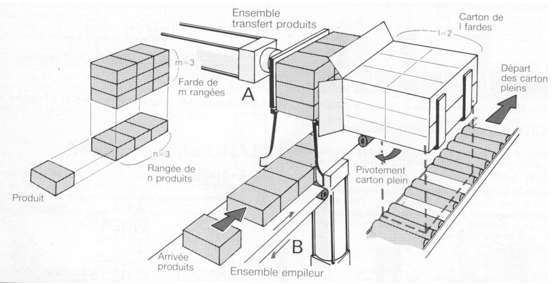

# Variante 22. Estación de embalaje de paquetes

> Páginas 25–26 del PDF original (variante 23 en el documento original). Tareas a realizar: [00-tareas-generales.md](00-tareas-generales.md)

## Elementos del proceso

Se pide automatizar la estación de embalaje de paquetes indicada por la figura. La estación de embalaje consta de los siguientes elementos:

1. Cinta transportadora por la que llegan los paquetes individuales.
2. Pistón B donde se van depositando los paquetes que llegan por la cinta transportadora y los apila.
3. Pistón A que introduce los paquetes en la caja de cartón.
4. Plataforma giratoria accionada por el pistón B que deposita la caja sobre la cinta transportadora de salida.

## Descripción del proceso

El funcionamiento del sistema es el siguiente:

1. Los paquetes llegan por la cinta transportadora y se van depositando sobre la plataforma del pistón B.
2. Cuando el primer paquete que llegó activa el sensor t1 es señal de que se ha completado una hilera de tres paquetes. A continuación el pistón B sube a través de una sección elástica que permite el ascenso y no el descenso de los tres paquetes. El movimiento del pistón B está controlado por los finales de carrera b1 y b2. Esta maniobra se repite hasta conseguir una altura de tres paquetes. La altura de tres paquetes se detecta con el final de carrera t2.
3. Una vez se dispone de un grupo de 9 paquetes, el pistón A avanza para introducirlos en la caja de cartón. El pistón B sirve de guía. El sensor de sobrepresión t3 indica que el pistón A ha introducido el paquete en la caja. Cuando el final de carrera a2 se activa a la vez que t3, la caja está llena. Mediante la regulación de la posición del final de carrera a2, se pueden introducir más o menos filas de paquetes en la caja.
4. A continuación la caja es depositada sobre la cinta transportadora de salida mediante el pistón D. El recorrido está controlado por el final de carrera d1. Cuando la caja es evacuada, el operador coloca una caja vacía sobre la plataforma. El operador indica al sistema que la caja está colocada mediante un pedal.

El sistema puede empaquetar diferentes tamaños de paquetes dentro de un cierto margen. Esto se consigue variando el ajuste del final de carrera a2.

