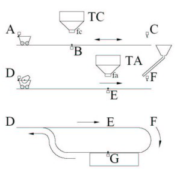

# Variante 23. Volcado de mezcla de cemento

> Tareas a realizar: [00-tareas-generales.md](00-tareas-generales.md)

## Elementos del proceso

El sistema de ejemplo es el que aparece en la figura. El objetivo es realizar el volcado de una mezcla de cemento en la zona rectangular G. Los elementos disponibles en el sistema son los siguientes:

- Dos vagonetas que cargarán los elementos necesarios (cemento y agua). La vagoneta 1 cubre el trayecto AC (parte superior) y la vagoneta 2 el trayecto DFG (parte inferior).
- Dos tolvas, una que almacena cemento (tolva C) y otra que almacena agua (tolva A).
- Dos accionadores en cada tolva que provocan el vertido de los materiales respectivos (identificadores TC y TA).
- Dos dosificadores para cada tolva que indican cuándo se dispone de la cantidad suficiente de material (identificadores fc y fa).
- Un pulsador de arranque M.
- Seis sensores, a, b, c, d, e y f, que se activan cuando las vagonetas están situadas en las posiciones A, B, C, D, E y F, respectivamente.
- La vagoneta 1 (superior) dispone de un motor con dos sentidos de marcha: a derecha (señal MD1) y a izquierda (señal MI1). También dispone de un mecanismo de volcado del material (accionamiento VC), junto a un sensor que se activa cuando detecta la finalización del volcado de material (fvc).
- La vagoneta de la parte inferior sólo dispone de un sentido de marcha a derecha (señal MD2). También dispone de un molinete que se acciona con la señal MOL, y un dispositivo de descarga que se activa con la señal DES, junto con un sensor de fin de descarga fdes.

## Descripción del proceso

El proceso a controlar debe seguir los pasos siguientes:

1. El ciclo comienza con el accionamiento del pulsador de arranque M, si además las dos vagonetas se encuentran situadas en los puntos A y D.
2. La vagoneta superior debe dirigirse hacia el punto B, debajo de la tolva de cemento, para realizar la carga. Después debe dirigirse al punto C donde volcará el cemento a la vagoneta del circuito inferior. El volcado debe producirse sólo si la otra vagoneta está situada debajo.
3. La vagoneta inferior debe comenzar su recorrido cuando la otra vagoneta se sitúe debajo de la tolva de cemento y se detendrá a cargar agua debajo de la tolva de agua, para posteriormente dirigirse al punto F para recibir la descarga de cemento de la vagoneta superior.
4. Cuando finalice la descarga de cemento, la vagoneta superior debe regresar a su punto de partida A.
5. Simultáneamente, la vagoneta inferior debe activar su molinete al tiempo que se dirige al punto G de descarga. Cuando finalice la descarga deberá dirigirse al punto D cerrando el recorrido del circuito.
