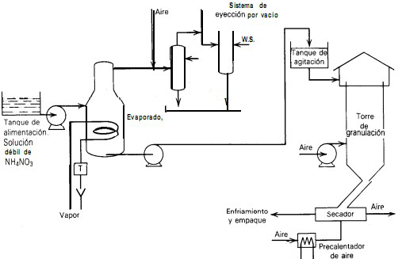

# Variante 24. Planta para la elaboración del nitrato de amonio

> Página 28 del PDF original (variante 25 en el documento original). Tareas a realizar: [00-tareas-generales.md](00-tareas-generales.md)

## Descripción del proceso

El nitrato de amonio es uno de los principales fertilizantes; en la figura B-1 se aprecia el proceso para su manufactura: desde un tanque de alimentación se bombea una solución débil de nitrato de amonio (NH4NO3) a un evaporador; en la parte superior del evaporador hay un sistema de expulsión por vacío; el vacío se controla con el aire que entra al sistema.

La solución concentrada se bombea a un tanque de agitación, y de ahí se alimenta a la parte superior de una torre de granulación (pulverización). El desarrollo de esta torre es uno de los más importantes en la industria de fertilizantes de la postguerra. En esta torre, la solución concentrada de NH4NO3 se lanza desde la parte superior contra una corriente de aire; el aire es suministrado mediante un ventilador situado en el fondo de la torre. Con el aire se enfrían las gotas de forma esférica y se elimina parte de la humedad, con lo cual quedan gránulos húmedos.

Después, los gránulos se llevan a un secador rotatorio, donde se secan; entonces se enfrían y se llevan a un mezclador, donde se les añade un agente antiadherente (arcilla o tierra diatomácea) y se empacan para el embarque.

