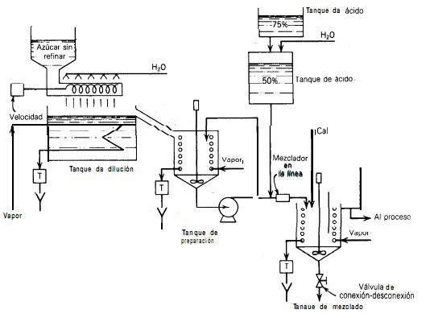

# Variante 25. Sistema de refinación de azúcar

> Páginas 28–29 del PDF original (variante 26 en el documento original). Tareas a realizar: [00-tareas-generales.md](00-tareas-generales.md)

## Descripción del proceso

El azúcar crudo se alimenta al proceso a través de un transportador de tornillo y se rocía agua sobre ésta para formar un jarabe, el cual se calienta en el tanque de disolución, de donde fluye al tanque de preparación, en el cual se realiza un mayor calentamiento y la mezcla. Del tanque de preparación el jarabe se envía al tanque de mezclado; conforme el jarabe fluye hacia el tanque de mezclado, se le añade ácido fosfórico y, ya en el tanque, cal. Este tratamiento con ácido, cal y calor tiene dos objetivos: el primero es la clarificación, es decir, con el tratamiento se coagulan y precipitan el calor de azúcar cruda. Después del tanque de mezclado se continúa el proceso del jarabe.

## Detalles de diseño

Se piensa que es importante controlar las siguientes variables:

1. Temperatura en el tanque de disolución.
2. Temperatura en el tanque de preparación.
3. Densidad del jarabe que sale del tanque de preparación.
4. Nivel en el tanque de preparación.
5. Nivel en el tanque de ácido al 50 %; el nivel en el tanque de ácido al 75 % se puede suponer constante.
6. La fuerza del ácido al 50 %; la fuerza del ácido al 75 % se puede suponer constante.
7. El flujo de jarabe y ácido al 50 % que entran al tanque de mezclado.
8. El pH de la solución en el tanque de mezclado.
9. La temperatura en el tanque de mezclado.
10. En el tanque de mezclado se requiere únicamente una alarma de nivel alto.
