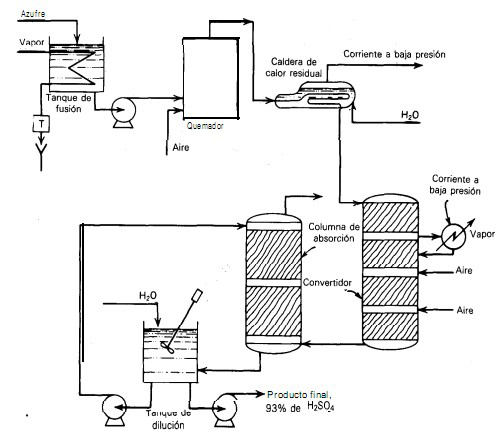

# Variante 26. Proceso del ácido sulfúrico

> Páginas 29–30 del PDF original (variante 27 en el documento original). Tareas a realizar: [00-tareas-generales.md](00-tareas-generales.md)

## Descripción del proceso

En la figura se ilustra el diagrama de flujo simplificado para la manufactura de ácido sulfúrico (H2SO4). El azufre se carga en un tanque de fundición donde se mantiene en estado líquido; de ahí pasa a un quemador, donde reacciona con el oxígeno del aire y se produce SO2 mediante una reacción química.

Del quemador, los gases pasan a través de una caldera de calor residual, donde se produce vapor mediante la recuperación del calor de la reacción anterior. De la caldera, los gases pasan a través de un convertidor catalítico de cuatro etapas (reactor), en el cual tiene lugar la reacción correspondiente.

Del convertidor, los gases se envían a una columna de absorción, donde los gases de SO3 se absorben.

El líquido que sale del absorbedor concentrado (98 %) pasa a un tanque de circulación, donde se diluye de nuevo al 93 % con H2O. Parte del líquido de este tanque se utiliza entonces como medio de absorción en el absorbedor.

## Detalles de diseño

Se piensa que es importante controlar las siguientes variables:

1. Nivel en el tanque de dilución.
2. Temperatura del azufre en el tanque de fundición.
3. Aire que entra al quemador.
4. Nivel de agua en la caldera de calor residual.
5. Concentración de SO3 en el gas que sale del absorbedor.
6. Concentración de H2SO4 en el tanque de disolución.
7. Nivel en el tanque de disolución.
8. Temperatura de los gases que entran a la primera etapa del convertidor.
