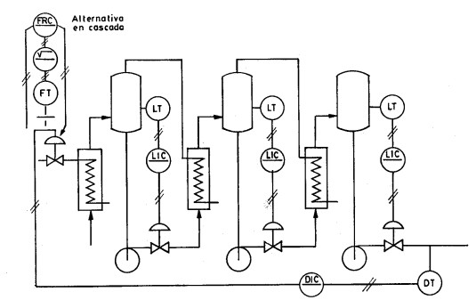

# Variante 28. Evaporador de triple efecto

> Página 31 del PDF original (variante 29 en el documento original). Tareas a realizar: [00-tareas-generales.md](00-tareas-generales.md)

## Descripción del proceso

El principal objetivo de los evaporadores es el aumento de la concentración del sólido disuelto en la solución alimentada, aunque además se utilizan con objetivos colaterales como el de la producción de vapor. El incremento de la concentración de las sustancias sólidas en la solución alimentada al evaporador se obtiene mediante la eliminación parcial del disolvente (generalmente agua) en todo el volumen de la solución, a su temperatura de ebullición.

El calor requerido para la evaporación del disolvente se puede suministrar empleando cualquier agente de calefacción; no obstante, en la mayoría de los casos se emplea como agente de calefacción el vapor de agua, al que se designa con el nombre de vapor primario. El vapor se genera en un calentador colocado a la entrada de cada uno de los evaporadores; la temperatura en los mismos se controla con ayuda de sensores. En la salida de cada evaporador se colocan electrobombas que ayudan a desplazar el exceso de vapor al siguiente evaporador o al resto del proceso, según corresponda.

La entrada de vapor al primer evaporador se realiza con ayuda de una electroválvula accionada con un motor eléctrico (valor fijo); éste valor se establece a partir de la medición del punto de ebullición, es decir, la diferencia de temperaturas entre el líquido en ebullición en el evaporador y el condensado a la misma presión absoluta y actuando sobre la salida del producto.

En cada evaporador se controla el nivel, variando la entrada del producto, y se regula la concentración midiendo la elevación del punto de ebullición.
