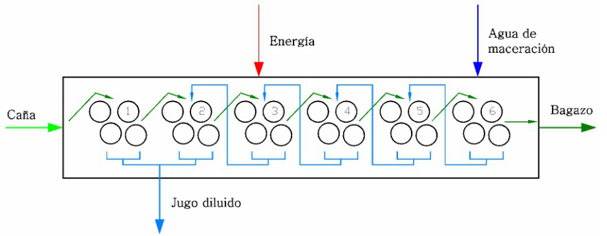
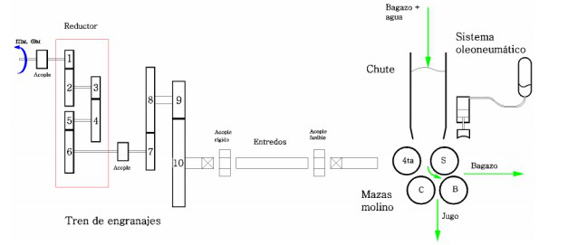

# Variante 29. Molinos central azucarero

> Tareas a realizar: [00-tareas-generales.md](00-tareas-generales.md)

## Descripción del proceso

La estación de extracción consiste generalmente de 5 ó 6 molinos en cascada, como se muestra en la figura:

Principio de funcionamiento:

- Cada molino consta de 4 mazas. La caña preparada por las picadoras y/o desfibradoras se alimenta al primer molino por medio de un transportador de velocidad variable.
- El bagazo resultante del primer molino se alimenta al siguiente por medio de un transportador que opera a velocidad fija y así sucesivamente hasta el sexto.
- El bagazo que sale del último molino se lleva a calderas como combustible.
- A la entrada del último molino se adiciona agua de imbibición para diluir el jugo y extraer la sacarosa que contiene el material fibroso; el contenido de jugo que resulta de cada extracción se envía al molino anterior y así sucesivamente hasta el segundo.
- El contenido de jugo extraído por el primero y segundo molino es enviado a la etapa de proceso.
- El bagazo es alimentado a la tolva por un transportador de rastrillos.

La figura muestra el esquema de un molino de caña típico.

Se utilizan dos actuadores para manipular la compuerta a la salida de la tolva de alimentación (*chute* en inglés) para regular el flujo de bagazo de entrada y la velocidad, para regular el par medido y la altura de la tolva.

En general, los molinos del segundo al sexto son idénticos en operación; usan la misma instrumentación y estructura de control y sus lazos son independientes.
