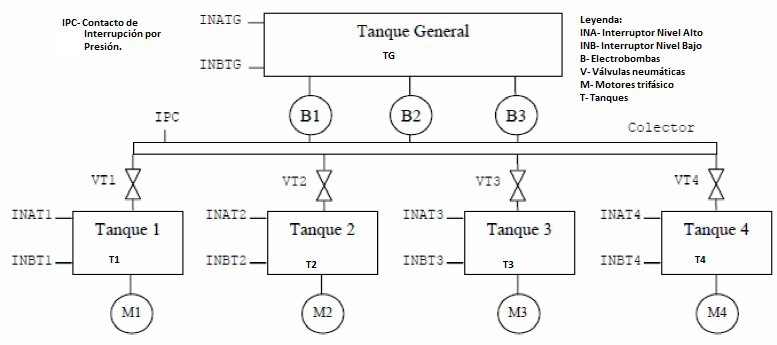

# Variante 31. Proceso suministro de combustible

> Tareas a realizar: [00-tareas-generales.md](00-tareas-generales.md)

## Descripción del proceso

Automatizar la planta de suministro de combustible a los tanques de consumo diario de fuel oil de los motores 1, 2, 3 y 4 de una central de generación desde el tanque de almacenamiento general del parque de combustible de dicha central.

El mando de la válvula se realiza a través de dos electroválvulas en el circuito de alimentación neumática y finales de carrera correspondientes.

El colector de llenado de los tanques es alimentado por 3 bombas de similares características con capacidad cada una de ellas para llenar hasta un máximo de 3 tanques de modo simultáneo. En caso de que fuese necesario estar llenando los cuatro a la vez sería necesario tener 2 de las tres bombas arrancadas.

- Recomendamos utilizar un selector de tres posiciones: MAN, SEMI y AUTO.
- Una seta de emergencia, SE.
- Para que las bombas puedan funcionar, al menos una válvula ha de estar abierta.

Leyenda de la figura: INA = interruptor nivel alto; INB = interruptor nivel bajo; B = electrobombas; V = válvulas neumáticas; M = motores trifásicos; T = tanques; IPC = contacto de interrupción por presión.
