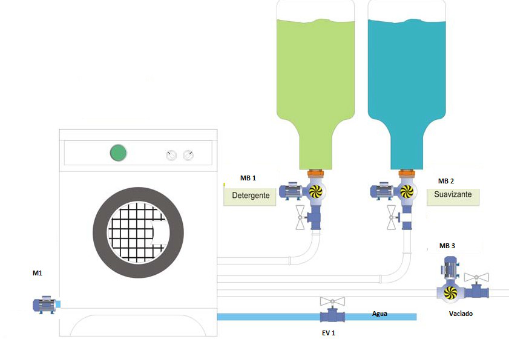

# Variante 32. Proceso de lavadora industrial

> Páginas 33–34 del PDF original (variante 33 en el documento original). Tareas a realizar: [00-tareas-generales.md](00-tareas-generales.md)

## Descripción del proceso

El procedimiento lógico es el siguiente:

a) Cuando esté la ropa dentro y cerrada la compuerta de entrada se pesa la ropa y se deja entrar agua en dependencia de la cantidad de ropa: poca, media, lleno. También se incorpora el detergente.

b) Se realiza el lavado durante cinco minutos en un sentido de giro y en sentido contrario cinco minutos más (M1). Se extrae el agua.

c) Se llena la lavadora con agua limpia y se procede a enjuagar durante 5 minutos de movimiento alternativo derecha-izquierda. Se vuelve a vaciar la lavadora.

d) Se agrega el suavizante y agua para proceder al último enjuague y se vacía la lavadora.

e) Se energiza una alarma para indicar que terminó el proceso.

> Nota: en el documento original la lista anterior aparece repetida a continuación de la figura con la numeración f)–j), con idéntico contenido.
