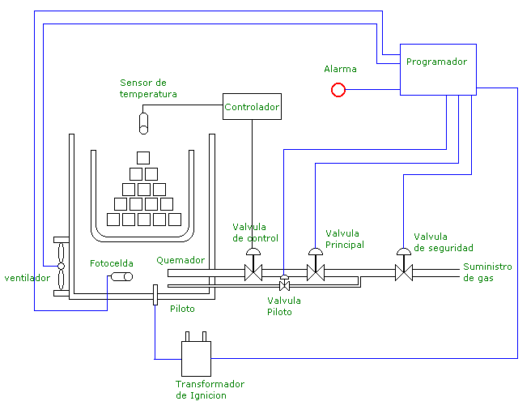

# Variante 33. Horno a gas

> Páginas 34–35 del PDF original (variante 34 en el documento original). Tareas a realizar: [00-tareas-generales.md](00-tareas-generales.md)

## Descripción del proceso

Agregar vagoneta para trasladar los ladrillos; cuando está llena se traslada al horno; cuando el horno está lleno (3 vagonetas), cerrar puerta y comenzar el proceso. Controlar temperatura y tiempo.

Investigar: suministro de gas.
