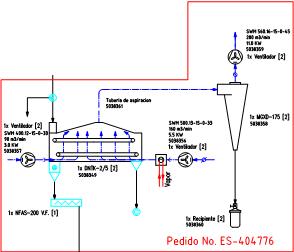

# Variante 34. Proceso de secado

> Páginas 35–36 del PDF original (variante 35 en el documento original). Tareas a realizar: [00-tareas-generales.md](00-tareas-generales.md)

## Descripción del proceso

El proceso de secado de cereal se realiza en un secador de esteras; este es un proceso secuencial en el cual se encienden primeramente los motores M_A2003 y M_A2004 que son los encargados de mover los ventiladores para proporcionar aire al secador a través de unas tuberías.

Para calentar este aire se utiliza un serpentín el cual envuelve una de las tuberías y a través de este se hace circular un flujo de vapor saturado el cual permite calentar el aire que va hacia el secador; esto se logra abriendo la válvula V-2009. Se espera a que la temperatura aumente hasta alcanzar el valor deseado; esta parte es controlada visualmente observando un indicador de temperatura, de este modo el operador puede ir regulando la temperatura con la válvula V-2009 actuando sobre ella manualmente.

Luego se pone a trabajar el motor M_A2002, que es el encargado de mover la estera, la cual se encarga de transportar el producto desde la entrada del secador hasta la salida del mismo. Seguidamente se pone en funcionamiento el motor M_A2001, que tiene como función mover el mecanismo de suministro de cereal dejándolo caer uniformemente sobre la estera. Después se enciende el motor M_A2007, cuya función es extraer el producto del secador haciendo girar el sistema de descarga logrando así incorporar el producto a la próxima etapa. (Vincular con Biotecnología.)
