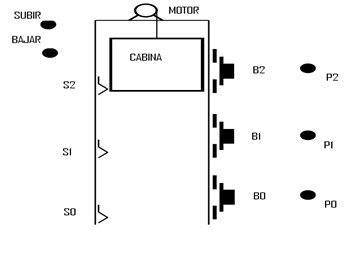

# Variante 35. Elevador docente

> Página 36 del PDF original (variante 36 en el documento original). Tareas a realizar: [00-tareas-generales.md](00-tareas-generales.md)

## Descripción del proceso

Realice los diseños de los circuitos de control y de fuerza que garanticen el funcionamiento del ascensor mostrado y del que se encuentra en el laboratorio docente de la disciplina.

El sistema consta de 3 pulsadores para llamar al ascensor desde el exterior (B0, B1, B2), 3 detectores de presencia (S0, S1, S2) para determinar en qué piso se encuentra el ascensor y 3 LEDs P0, P1, P2 que indican en qué piso se encuentra el ascensor.

Finalmente existen otros dos LEDs: SUBIR, encendido cuando el ascensor sube, y BAJAR, encendido cuando el ascensor baja.

Las señales de estos LEDs podrían emplearse directamente para controlar el motor del ascensor.
