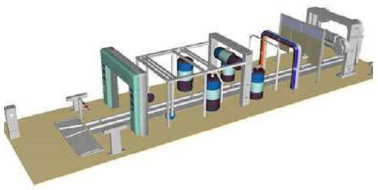

# Variante 36. Central de lavado de autos 2

> Páginas 36–38 del PDF original (variante 37 en el documento original). Tareas a realizar: [00-tareas-generales.md](00-tareas-generales.md)

## Descripción del proceso

Contamos con un tren de lavado lineal, es decir, que está dividido en cuatro etapas dispuestas una a continuación de otra, con capacidad para que todas trabajen de manera simultánea si es necesario. Esto es, el túnel podría estar trabajando con cuatro vehículos a la vez, realizando una tarea en cada uno de ellos.

A estas etapas las llamaremos puestos y son:

| Puesto | Función |
|---|---|
| P1 | Puesto de enjabonado |
| P2 | Puesto de cepillado |
| P3 | Puesto de aclarado |
| P4 | Puesto de secado |

En cada una se lleva a cabo la tarea que indica su nombre.

La primera y la tercera se llevarán a cabo en un puente fijo, que favorece el reparto del líquido de trabajo (agua y jabón o agua sólo) por todo el vehículo sin necesidad de desplazarse, simplemente por la colocación de las salidas del fluido. Por el contrario, en los puestos dos y cuatro no es posible distribuir la operación que se efectúa (rodillos de cepillado y ventiladores de secado) por todo el coche de manera simultánea, de manera que se requiere un desplazamiento, tanto de los rodillos como de los ventiladores. Esto se conseguirá haciendo que ambos útiles estén instalados en pórticos móviles en la dirección del túnel. Para controlar su movimiento dispondremos de finales de carrera al inicio y término del recorrido (aproximadamente la longitud media de los vehículos a lavar). Para la detección de vehículo en un puesto determinado, se cuenta con cuatro células fotoeléctricas situadas a la mitad de la longitud de cada puesto.

Se dispone también de una barrera a la entrada del puente, con finales de carrera que indican su estado. Los coches, una vez que se posicionan en el puesto uno, apagan el motor y son llevados por una cinta transportadora.

Como elementos de seguridad existen indicadores de niveles bajos en los depósitos de agua y jabón.

Hay un cuadro de control con un pulsador de marcha, uno de paro y una seta de emergencia (además de lámparas que serán empleadas como indicadores del funcionamiento normal, reposo o emergencia del sistema).

Por último, los elementos a controlar:

- Motor de la bomba de agua y jabón.
- Motor de la bomba de agua.
- Motor de la cinta transportadora.
- Motor de la barrera.
- Motor de ventiladores.
- Motor de los dos puentes móviles.

## Especificaciones adicionales

- **PARADA DE EMERGENCIA:** en cualquier momento que se pulse la seta de emergencia, una vez se ha iniciado la marcha, el sistema debe ir a un estado de emergencia, en el que se encienda la bombilla de paro de manera intermitente.
- **REARME:** cuando salimos del estado de emergencia, que ha provocado la parada del sistema en cualquier momento, pasamos a una etapa de rearme en la que se baja la barrera y se hace retroceder a los rodillos hasta su posición inicial.
- **PULSADOR PARADA:** si se pulsa parada una vez que ha comenzado el ciclo, éste se ejecuta completo, y cuando lo hace vuelve al estado de parada.
- **BOMBILLAS INDICADORAS:** siempre que el sistema esté en marcha, permanecerá encendida la lámpara de marcha de forma fija. Si está en parada o rearme, estará encendida la bombilla de parada. Si estamos en estado de alarma por falta de agua y/o jabón, o emergencia por accionamiento de la seta, se encenderá de manera intermitente la lámpara de parada.
- **NIVELES:** posterior al estado de parada realizamos una comprobación de niveles de agua y jabón previa a la entrada en el ciclo. Al final del mismo se realizará una segunda comprobación de manera que se asegure que, en caso de funcionamiento prolongado, una falta de uno de los dos elementos haga detener el sistema. Cuando esto ocurra, se evolucionará a una etapa de alarma, con la lámpara de paro intermitente, y podremos salir de ese estado mediante llenado de los depósitos y pulsando de nuevo marcha.
- **BARRERA:** la barrera se bajará cuando se ejecute el rearme. Se subirá al evolucionar del estado de parada al inicio del ciclo para permitir la admisión. Una vez en el ciclo atenderá a la presencia o no de coche en el puesto uno para subir o bajar, de manera que permanecerá subida siempre y cuando no haya coche en el puesto uno (enjabonado), y se cerrará al finalizar en caso de que al comenzar un nuevo ciclo haya vehículo en este puesto. En el caso de que, finalizado un ciclo, se levante la barrera si no hay coche en uno, se esperará un tiempo establecido de admisión para la entrada de nuevo vehículo, antes de comenzar ninguna acción.
- **CINTA TRANSPORTADORA:** cuando hayan acabado todas las acciones en los cuatro puestos, y en caso de que siga habiendo coches (pues las etapas en el túnel podrían estar en su estado de finalización aun no habiendo vehículos), hacemos avanzar la cinta transportadora, que gestionaremos mediante un temporizador, ya que siempre se avanza la misma distancia (para ello los centros de los puestos han de estar equidistantes).
- **CINTA SIN COCHES:** en caso de que en cada puesto tengamos activado el indicador de finalización de la etapa y que no haya ningún coche sobre la cinta, haremos evolucionar el sistema hacia el estado de parada a la espera de volver a pulsar Marcha.
- **PUESTO 1:** cuando el ciclo está activado (pulsador de marcha) y hay coche en él se activa la bomba de agua y jabón durante un tiempo establecido de enjabonado. Cuando se cumpla este tiempo evoluciona a un estado indicador del final del puesto. En caso de no haber coche, directamente pasamos al final del puesto.
- **PUESTO 2:** si el ciclo está activado y hay coche en él, se hace funcionar el motor de los rodillos y, a la vez, el motor del avance del puente, que irá desde el final de carrera izquierdo hasta el derecho y retrocederá de nuevo a la posición inicial. La velocidad de este recorrido habría de ser adaptada (mediante reductores) al tiempo estipulado de cepillado. Cuando se cumpla el recorrido del puente, los rodillos paran y se pasa a un estado indicador del final del cepillado. A éste estado indicador accedemos también en caso de que se active el puesto y no haya coche.
- **PUESTO 3:** funcionamiento similar al puesto 1, con la diferencia de que ahora la bomba es de agua exclusivamente.
- **PUESTO 4:** funcionamiento similar al puesto 2, con la diferencia de que en lugar de activar el motor de los rodillos, se activa un motor de accionamiento de ventiladores.

> Nota: el original dice literalmente "PUESTO 4: funcionamiento similar al puesto 4"; por contexto se trata del puesto 2 (el que usa pórtico móvil).
