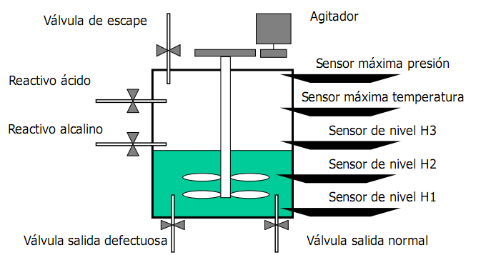

# Variante 37. Reactor químico

> Página 38 del PDF original (variante 38 en el documento original). Tareas a realizar: [00-tareas-generales.md](00-tareas-generales.md)

## Descripción del proceso

- Al pulsar el botón de arranque, se introduce reactivo alcalino hasta el nivel H2. Después se vierte ácido hasta el nivel H3. Durante esos dos pasos la válvula de escape permanece abierta. Después se cierra la válvula de escape y empieza el calentamiento. Durante este calentamiento se agita la mezcla cambiando el sentido de giro cada 10 s. Al alcanzar la máxima temperatura se para el calentamiento y se abre la válvula de escape y la de salida normal. Cuando el nivel llega a H1 se vuelve a iniciar el ciclo. En todo momento la válvula de funcionamiento permanece encendida. Si al pulsar el botón de arranque el nivel está por encima de H1, primero se vacía el depósito por la válvula de salida defectuosa hasta dejarlo al nivel H1.
- Si se pulsa el botón de parada se hace todo el ciclo completo y al acabar la fase de vaciado se queda parado en lugar de iniciar un nuevo ciclo.
- Si se activa en algún momento el sensor de máxima presión se abre la válvula de escape, se vacía el depósito y se va a la fase de parado.
- La fase de calentamiento está limitada a 10 minutos. Si pasados 10 minutos no se ha alcanzado la temperatura máxima, se procederá de igual forma que al alcanzar la máxima presión.
- Además de los sensores y actuadores de la figura anterior, el sistema lleva un pulsador de arranque, otro de parada y una lámpara indicando el funcionamiento.
- Se supone que las válvulas llevan un sistema mecánico automático para cerrarse.
