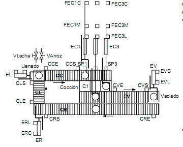

# Variante 39. Planta de fabricación de arroz con leche

> Páginas 40–41 del PDF original (variante 40 en el documento original). Tareas a realizar: [00-tareas-generales.md](00-tareas-generales.md)

## Descripción del proceso

El sistema consta de:

**Zona de llenado.** En esta zona se vierte leche y arroz sobre el recipiente de cocción situado sobre una báscula. La báscula está parada para pesar las cantidades adecuadas. Primero se vierte arroz utilizando la válvula VARROZ hasta que la báscula indica mediante BARROZ que se ha vertido la cantidad adecuada. A continuación se vierte VLECHE hasta que la salida digital BLECHE de la báscula se active. El recipiente lleno es desplazado por el empujador EL hacia la cinta CC en dirección a la cocción.

**Zona de cocción.** En la zona de cocción, el recipiente es llevado de la cinta CC al primer fuego disponible CX (1, 2 o 3) mediante el empujador ECX correspondiente (los sensores SPX indican la posición del recipiente). Cada empujador ECX es movido por un conjunto motor-variador con 2 entradas digitales: MECXA para el avance y MECXR para el retroceso. Además cada empujador tiene tres finales de carrera FECXC, FECXM y FECXL para indicar posición C (corta: empujador preparado para arrastrar recipiente de cinta a zona de cocción), M (media: recipiente sobre zona de cocción) y L (larga: recipiente sobre cinta de vaciado). La cocción dura exactamente 10 minutos. Cada zona CX tiene una señal CXO para activar y mantener el fuego en los quemadores. Transcurridos los 10 minutos se desactiva el fuego y el empujador ECX lleva el recipiente a la cinta CV.

**Zona de vaciado.** La cinta CV arrastra los recipientes hacia la zona de vaciado donde la máquina VAC se encarga de vaciarlos y enviar el producto a la envasadora. La máquina VAC tiene la entrada digital VACO para ordenar el vaciado y la salida digital VACT para indicar que ha terminado. A continuación el recipiente es depositado sobre la cinta de retorno CR mediante el empujador EV.

**Zona de retorno.** Los recipientes vacíos vuelven por la cinta de retorno CR. El empujador ER los envía hacia la cinta de llenado (CL) y de aquí pasan a la zona de llenado.

### Reglas de las cintas y empujadores

- La cinta CC se pone en marcha (si ya no lo estaba) cada vez que un nuevo recipiente es depositado mediante el empujador EL. Si un recipiente alcanza el sensor CCS y no hay hueco en la zona de cocción, la cinta se para hasta que se libere un fuego. La cinta también se para si no hay recipientes sobre ella. Para evitar problemas, cuando hay un recipiente esperando en CCS, el empujador EL introduce el siguiente recipiente una vez llenado (si lo hay) y no retrocede (se bloquea), con el fin de no acumular recipientes sobre la cinta CC.
- De igual forma, la cinta CL se para cuando un recipiente alcanza la posición de CLS y no puede avanzar porque el empujador EL está bloqueado. El empujador ER sólo puede introducir un nuevo recipiente en la cinta CL y no puede retroceder hasta que el recipiente en la posición CLS se desbloquee. CL también se para si no hay recipientes sobre ella.
- La cinta CR se para si no hay recipientes sobre ella o si, habiendo recipientes sobre ella, el empujador está en posición de bloqueo y no hay que introducir más recipientes desde la zona de vaciado. En cualquier otro caso la cinta está en movimiento.
- La cinta CV se para si no hay recipientes sobre dicha cinta o si hay un recipiente en la zona de vaciado y otro recipiente ha alcanzado el sensor CVS.
- Los empujadores EL, EV y ER son movidos por un motor-variador que tiene dos entradas digitales: EXA para ordenar el avance y EXR para ordenar el retroceso. Asociado a cada empujador hay dos finales de carrera para indicar posición mínima de retroceso (FEXM) y posición máxima (FEXL).

## Modos de funcionamiento

El sistema tiene dos modos de funcionamiento controlados por un conmutador en el pupitre de control:

- **Modo automático:** descrito anteriormente. Hay dos pulsadores PA y PP para arrancar y parar en modo automático. Cuando se da la orden de parar, el sistema no llena más recipientes y se para cuando todos los recipientes que estaban en cocción se hayan vaciado.
- **Modo manual supervisado:** mediante pulsadores se pueden mover todos los elementos del sistema.

Además existe una parada de emergencia que se activa mediante una seta de emergencia en el pupitre de control o mediante el sensor MO de detección de monóxido de carbono en los fogones de la zona de cocción. Existe un pulsador de rearme (además del rearme de la seta de emergencia) mediante el cual el operador indica que ya no hay situación de emergencia.
