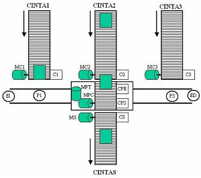

# Variante 40. Sistema de cintas transportadoras y plataforma móvil

> Páginas 41–42 del PDF original (variante 41 en el documento original). Tareas a realizar: [00-tareas-generales.md](00-tareas-generales.md)

## Descripción del proceso

El sistema permite recoger en una única cinta de salida (CintaS) los paquetes que provienen de tres cintas transportadoras de entrada (Cinta1, Cinta2 y Cinta3). Para ello el sistema se apoya en una cuarta cinta transportadora montada sobre una plataforma móvil (Cinta Plataforma) que se desplaza sobre unos raíles.

Además de los elementos ya indicados el sistema incluye:

- **Sensores P1, P2 y P3:** son finales de carrera que se cierran cuando la plataforma está en la posición adecuada para recibir un paquete de una determinada cinta de entrada (P2 está en la figura bajo la plataforma).
- **Sensores C1, C2 y C3:** son células fotoeléctricas que envían una señal lógica 1 cuando el paquete interrumpe el haz de luz. Su función es indicar que hay un paquete en la cabecera de la cinta.
- **Sensores CPE y CPS:** son células fotoeléctricas como las anteriores. Indican que un paquete está situado a la entrada o a la salida de la cinta transportadora.
- **Sensores ED y EI:** son dos finales de carrera de seguridad que se abren cuando la plataforma alcanza los extremos de los raíles.
- **MC1, MC2, MC3, MPC y MS** son los motores que mueven las cintas transportadoras, siempre en el mismo sentido. MS es el motor de la cinta de salida.
- **MPT** es el motor que mueve la plataforma en los sentidos derecho e izquierdo.

## Especificaciones de funcionamiento

- Cuando un paquete llega a la cabecera de una cinta transportadora, ésta se para hasta que la plataforma móvil vaya a recoger el paquete.
- Una vez situada la plataforma delante de la cinta con paquete, se inicia la transferencia del paquete. Para ello se mueven simultáneamente la cinta con el paquete y la cinta de la plataforma. La cinta de la plataforma se para cuando el paquete está completamente transferido.
- A continuación la plataforma se mueve hacia la cinta de salida. La plataforma se para cuando se alcanza el sensor P2.
- El paso siguiente es el proceso de transferencia del paquete desde la plataforma a la cinta de salida de igual forma que en la transferencia de una cinta de entrada a la plataforma.

Además al sistema se le imponen las siguientes condiciones en funcionamiento automático:

- Cada cinta de entrada está funcionando si no hay un paquete esperando en su cabecera para ser transferido a la plataforma móvil.
- La cinta de salida está funcionando siempre.
- Si hay más de una cinta de entrada parada esperando a la plataforma, el orden de prioridad en la atención es siempre Cinta1, Cinta2 y Cinta3.
- Si no hay paquetes en las cintas de entrada, la plataforma permanece parada en la posición de la cinta de salida.

El sistema tiene un modo de funcionamiento manual supervisado, donde a través de pulsadores se pueden mandar directamente los motores. La supervisión consiste en no permitir al operador mover la plataforma fuera del rango marcado por los sensores P1 y P3. Los modos manual y automático se seleccionan mediante un conmutador en el pupitre de control.

Además existe una parada de emergencia que se activa mediante una seta de emergencia en el pupitre de control, o mediante los finales de carrera de emergencia situados en los extremos de los raíles. Existe un pulsador de rearme (además del rearme de la seta de emergencia) mediante el cual el operador indica que ya no hay situación de emergencia.
