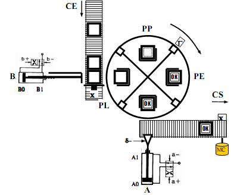

# Variante 41. Sistema de etiquetaje

> Tareas a realizar: [00-tareas-generales.md](00-tareas-generales.md)

## Descripción del proceso

La función del sistema es etiquetar los paquetes que entran por la cinta CE con una etiqueta rotulada con OK y, a continuación, sacarlos por la cinta CS. El etiquetado se lleva a cabo en el plato giratorio. Éste está dividido en cuatro zonas o estaciones: PL o zona de entrada; PP o zona de depósito del pegamento; PE o zona de depósito de la etiqueta; y PV o zona de salida.

El funcionamiento automático del sistema es el siguiente:

- Los paquetes entran por la cinta CE y se paran cuando llegan al tope donde está el sensor CP. La cinta CE pertenece a otro sistema.
- Con el pistón B se introduce el paquete en la zona PL.
- Se gira el plato para que el paquete pase a la zona PP. El sensor G indica cuando se ha realizado el cuarto de giro necesario. El variador de velocidad que controla el motor del plato tiene una entrada digital MG para darle la orden de giro.
- Una vez en la zona PP, se procede a depositar el pegamento sobre la cubierta superior del paquete. La máquina de pegamento tiene una entrada digital OPP para indicarle que proceda a depositar el pegamento y una salida digital PPR para indicar que ha realizado su trabajo.
- Depositado el pegamento, se gira nuevamente un cuarto de giro la plataforma para ir a la zona PE y se procede a colocar la etiqueta. La máquina que deposita la etiqueta dispone de una entrada digital OPE para darle la orden de etiquetar y una salida digital PER para indicar que se ha realizado la operación.
- Nuevamente se gira la plataforma para ir a la zona PV donde el pistón A que, a través de la ventosa d-, toma el paquete de la plataforma giratoria y lo deja sobre la cinta CS. Hasta que no haya salido el paquete de la cinta CS (sensor CS), no se toma un nuevo paquete de la plataforma giratoria. La ventosa se activa a través de una entrada digital del mismo nombre (d-).
- Por supuesto, la automatización mantiene ocupadas todas las estaciones de la plataforma giratoria, siempre que lleguen paquetes suficientes por CE. Es decir, que a plena producción se obtendría un paquete etiquetado cada cuarto de giro de la plataforma. Si no hay paquetes la plataforma permanece sin girar a la espera. Cada zona de la plataforma tiene un sensor para indicar si hay paquete en esa zona: SPL, SPP, SPE y SPV.
- Los pistones A y B tienen dos entradas digitales: X+ para el avance, X- para el retroceso; y dos salidas digitales: X0 y X1 para indicar posición mínima y máxima respectivamente.

## Especificaciones adicionales

El sistema tiene dos modos de funcionamiento controlados por un conmutador en el pupitre de control:

- **Modo automático:** descrito anteriormente. Hay dos pulsadores PA y PP para arrancar y parar en modo automático. Cuando se da la orden de parar, el sistema no introduce más paquetes en la plataforma giratoria y espera a que salgan todos los paquetes ya introducidos en la plataforma por la cinta CS para parar.
- **Modo manual supervisado:** mediante pulsadores se pueden mover todos los elementos del sistema siempre. No se permite mover los pistones A y B si la plataforma no está parada en una posición correcta (sensor G activado).

Además existe una parada de emergencia que se activa mediante una seta de emergencia en el pupitre de control. Existe un pulsador de rearme (además del rearme de la seta de emergencia) mediante el cual el operador indica que ya no hay situación de emergencia.
