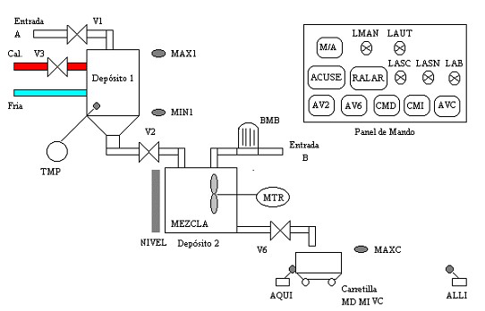

# Variante 42. Llenado y transporte de líquido

> Tareas a realizar: [00-tareas-generales.md](00-tareas-generales.md)

## Descripción del proceso

Se pretende realizar un automatismo que permita efectuar el llenado y transporte de cierto líquido formado por la mezcla de dos componentes A y B. Para ello se dispone de la instalación que se muestra en la figura.

Se dispone de dos depósitos:

- **Depósito 1:** lleva asociados tres sensores, dos de ellos capacitivos, uno de nivel mínimo (normalmente cerrado) y otro de nivel máximo, y un tercero de temperatura de tipo termostato. Asimismo consta de tres electroválvulas monoestables: V1 permite realizar el llenado, V3 introduce el vapor de calentamiento y V2 permite el vaciado hacia el segundo depósito.
- **Depósito 2:** incorpora un sensor de nivel capacitivo cuyo transmisor envía una señal analógica entre 0 y 10 V proporcional al volumen contenido en el depósito (0-1000 litros). La aportación de líquido A se realiza a través de la válvula V2 y la del líquido B por medio de una bomba accionada por un motor eléctrico con dos señales de retorno (contactor y defecto). La descarga de la mezcla hacia la carretilla se efectúa mediante la electroválvula monoestable V6. Asimismo el depósito dispone de un agitador motorizado.
- **Carretilla de transporte de líquido:** incorpora un sensor capacitivo para detectar el nivel máximo. Para desplazar la carretilla se dispone de un motor eléctrico con inversión de giro controlado a través de las señales MI (mover izquierda) y MD (mover derecha). Además existen dos finales de carrera electromecánicos (AQUI y ALLI) que marcarán las posiciones de carga y descarga respectivamente de la carretilla. El vaciado de la carretilla se realiza mediante la electroválvula monoestable VC.
- **Panel de mando:** formado por los pulsadores M/A, ACUSE, RESET ALARMA, AV6, AV2, CMD, CMI y AVC, y las lámparas LMAN, LAUT, LASC, LASN, LAB, para la supervisión del sistema.

## Funcionamiento

### a) Acondicionamiento del líquido A

En funcionamiento automático, el ciclo comienza con el llenado del depósito 1 por el componente A que antes de ser utilizado debe alcanzar una determinada temperatura. Los pasos son:

1. Con el sensor de nivel mínimo (MIN1) activo y las válvulas de salida del depósito 1 (V2) y de entrada de vapor (V3) cerradas, se abre V1 para permitir la entrada del líquido A.
2. Cuando se alcance el nivel máximo (MAX1) debe cerrarse V1.
3. Comienza entonces la etapa de calentamiento con vapor, en la que se abre la válvula V3. Cuando la temperatura alcanza el valor marcado en el termostato se produce una señal digital (TMP) que debe cortar la entrada de vapor, iniciándose el proceso de vaciado y mezcla sobre el depósito 2.

### b) Mezcla de A y B

En modo automático, mientras exista líquido en el depósito 1 y el depósito 2 contenga menos de 50 litros, se produce la mezcla de ambos componentes A y B según el siguiente proceso:

1. Se abre la válvula V2 de modo que el líquido A alcance 400 litros de nivel en el depósito 2, cerrando entonces dicha válvula. Si durante esta fase no hay suficiente líquido A, debe activarse el ciclo de acondicionamiento de A. El motor de mezcla (MTR) debe accionarse desde el comienzo de la operación de mezcla.
2. A continuación se acciona la bomba (BMB) permitiendo que el líquido B consiga llenar el depósito 2 hasta 900 litros.
3. Durante 50 segundos más debe estar funcionando el motor de mezcla (MTR) dejando el líquido en condiciones de ser transportado.

### c) Transporte del producto final

El vaciado del depósito 2 una vez realizada la mezcla se efectúa sobre la carretilla y a través de la válvula V6. La carretilla evoluciona entre los puntos AQUI, donde se carga, y ALLI donde se descarga. Los movimientos a derecha (MD) e izquierda (MI), y la operación de descarga (VC), que dura 20 segundos, deben ser activados automáticamente. Para indicar el llenado de la carretilla se dispone de un sensor de nivel máximo, MAXC.

### d) Paso modo manual/automático

El paso de modo de funcionamiento manual a automático y su funcionamiento depende de que se cumplan las condiciones iniciales (sistema en modo manual, depósitos 1 y 2 vacíos y carretilla en AQUI). La única forma de proceder a dicho paso es a través del pulsador M/A; si se pulsa pasa a automático, posteriormente a manual y así sucesivamente.

El paso de automático a manual se puede realizar con el pulsador M/A o porque se produzca alguna alarma.
