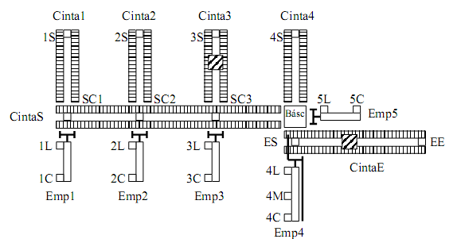

# Variante 43. Clasificador de paquetes pesados

> Tareas a realizar: [00-tareas-generales.md](00-tareas-generales.md)

## Descripción del proceso

Los paquetes entran por la cinta E, son pesados en la báscula y, en función de su peso, salen por una de las 4 cintas de salida. Las cintas son de tipo cadena: los paquetes son arrastrados por 2 cadenas que giran como si fuesen una cinta. La velocidad de desplazamiento es lenta.

### Funcionamiento del sistema

- Hay una cinta de entrada (CINTAE) por la cual llegan los paquetes hasta el empujador 4.
- El empujador 4 (EMP4) deposita el paquete en la báscula. Ésta tiene una entrada digital BI y 3 salidas digitales: BP, B0 y B1. Cuando la señal que recibe BI cambia de 0 a 1, la báscula inicia la operación de pesar. Con BP la báscula indica que ha pesado. En B0 y B1 aparece la codificación del peso: 00 significa que el paquete debe salir por la cinta 1, 10 por la 2, 01 por la 3 y 11 por la 4.
- Una vez pesado el paquete, éste sale por la cinta correspondiente, utilizando los empujadores de forma adecuada y la cinta S. SC1, SC2 y SC3 indican qué posición ocupa el paquete. Para evitar cabeceos cuando los paquetes salen por la cinta S y han llegado a su cinta de destino, la cinta S se para antes de que actúe el correspondiente empujador.
- Cada empujador tiene asociadas sus correspondientes señales de avance y retroceso (EXA, EXR). La parte eléctrica de cada empujador es un conjunto variador-motor.
- Cada cinta tiene asociada su correspondiente entrada digital (MX) para dar la orden de arranque y parada. También están movidas por un conjunto variador-motor.

## Modos de funcionamiento

El sistema tiene tres modos de funcionamiento controlados por un conmutador en el pupitre de control:

- **Modo automático lento:** descrito anteriormente. Hay dos pulsadores PA y PP para arrancar y parar éste modo. Cuando un paquete es detectado por el sensor EE, la cinta E se pone en marcha, el paquete es pesado, y en función de su peso sale por la cinta correspondiente. Solamente se ponen en marcha aquellas cintas que son necesarias. Una vez que una cinta ha realizado su trabajo, se para. Mientras un paquete está en el sistema, otro u otros paquetes pueden llegar por la cinta E. Éstos son retenidos por el empujador 4 hasta que el paquete anterior ha salido del sistema. Cuando se da orden de parar, el sistema espera a que todos los paquetes hayan salido.
- **Modo automático rápido:** es un modo de funcionamiento similar al anterior donde se permite que varios paquetes salgan simultáneamente por varias cintas, siempre que no haya colisiones. Una vez que el paquete ha sido pesado y ha salido de la zona de báscula, ya puede entrar un nuevo paquete. Esto significa que sobre la cinta S puede haber varios paquetes. La cinta S siempre se detiene, como ya se ha dicho anteriormente, para que el empujador correspondiente pase el paquete de la cinta S a la cinta de salida (si no se utiliza la cinta 4). Sólo están en marcha aquellas cintas que son necesarias. Los pulsadores PA y PP tienen el mismo funcionamiento.
- **Modo manual supervisado:** mediante pulsadores se pueden mover todos los elementos del sistema.

Además existe una parada de emergencia que se activa mediante una seta de emergencia en el pupitre de control. Existe un pulsador de rearme (además del rearme de la seta de emergencia) mediante el cual el operador indica que ya no hay situación de emergencia.
