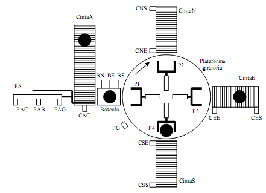

# Variante 44. Clasificador automático de paquetes

> Páginas 46–47 del PDF original (variante 45 en el documento original). Tareas a realizar: [00-tareas-generales.md](00-tareas-generales.md)

## Descripción del proceso

El clasificador está formado por una cinta de entrada (Cinta A), un plato giratorio con cuatro empujadores, tres cintas de salida (Cinta N, Cinta E y Cinta S), una báscula y un empujador PA que alimenta a la báscula desde la cinta de entrada, y al plato giratorio desde la báscula.

Los paquetes llegan por la Cinta A. Mediante el empujador PA cada paquete es colocado en la báscula. Ésta tiene tres salidas digitales que están calibradas para indicar la cinta por la cual debe salir el paquete: BN indica Cinta N, BE indica Cinta E y BS indica Cinta S. Una vez pesado el paquete y determinada su cinta de salida, el empujador PA lo deposita en el hueco correspondiente del plato giratorio. El plato giratorio gira hasta dejar el paquete en frente de la cinta de salida correspondiente. Aquí el empujador correspondiente del plato giratorio depositará el paquete en la cinta de salida.

Las cintas de salida se ponen en funcionamiento cuando detectan paquete en la cabecera y se paran cuando detectan que el paquete ha salido. Para ello van equipadas con sensores en la entrada y en la salida (CxE y CxS). La Cinta A siempre está en movimiento si no hay parada del sistema. El diseño mecánico de Cinta A y el empujador PA permite acumular paquetes en la cinta e ir sacándolos uno a uno con el empujador PA. El sensor CAC indica si hay paquete listo para ser introducido en la báscula.

Cada empujador del plato giratorio lleva dos finales de carrera (FPxM y FPxX) para indicar posición mínima y máxima (no están dibujados en la figura). El empujador PA lleva tres finales de carrera, PAC, PAB y PAG, para indicar posición de admitir paquetes desde la cinta, posición de paquete sobre báscula y posición de paquete sobre plato giratorio. El empujador PA no choca con los empujadores del plato giratorio. Cada empujador es movido por un conjunto variador-motor (MPA, MP1, MP2 y MP3) con dos entradas digitales (MxxA y MxxR) para indicarles movimiento de avance o de retroceso.

El plato giratorio es movido por el motor-variador MG en el sentido de las agujas del reloj. Cada vez que se activa el sensor PG coincide con un cuarto de giro del plato giratorio donde los empujadores están en la posición correcta (ejemplo: la mostrada en la figura). MG tiene una entrada digital (OMG) para indicarle giro o parada.

## Modos de funcionamiento

El sistema tiene tres modos de funcionamiento que se seleccionan mediante un conmutador en el pupitre de control:

- **Manual:** permite mover libremente mediante pulsadores situados en el pupitre de control los empujadores, las cintas y el plato giratorio. En el pupitre de control se señaliza mediante pilotos el estado de los sensores y finales de carrera.
- **Semiautomático:** hasta que un paquete no haya salido por su cinta correspondiente no comienza el tratamiento de un nuevo paquete. El empujador PA deposita el paquete en la báscula, después lo pasa al plato giratorio, y a continuación retrocede para tomar un nuevo paquete. Sin embargo, no lo traslada a la báscula hasta que el anterior no haya sido introducido en la cinta correspondiente. Por tanto, en este modo como máximo habrá un paquete sobre el plato giratorio.
- **Automático:** es el modo de máxima producción. Siempre que haya hueco en el plato giratorio se introduce un nuevo paquete. Por lo tanto, en éste puede haber hasta cuatro paquetes en el plato giratorio.

En el pupitre de control hay además una seta de emergencia que, al ser pulsada, para el sistema inmediatamente. Junto con la seta de emergencia existe un pulsador de rearme. Una vez pulsada la seta de emergencia, la maniobra para rearmar el sistema es: rearmar la seta de emergencia, pulsar el pulsador de rearme y colocar el conmutador en posición de manual. A partir de aquí se puede seguir en manual o pasar a semiautomático o automático.

Existen dos pulsadores para marcha y paro (PM y PP) de los modos semiautomático y manual. La parada siempre es a final de ciclo. Además existe un pulsador de pausa para interrumpir momentáneamente el funcionamiento en el modo automático o en el semiautomático. Al pulsar la primera vez el pulsador de pausa se congela el funcionamiento y al volver a pulsar se reanuda el funcionamiento.

> Nota: si es necesario, puede haber un sensor asociado a cada posición norte, sur, este y oeste del plato giratorio para indicar que el plato tiene un paquete en esa posición.
