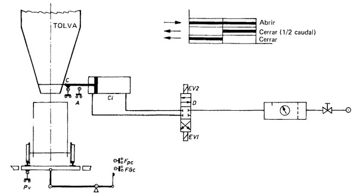

# Variante 45. Llenado de vagoneta

> Tareas a realizar: [00-tareas-generales.md](00-tareas-generales.md)

## Descripción del proceso

Esquema electroneumático utilizado para la carga de una vagoneta con mineral.

El circuito neumático tiene por finalidad abrir una tajadera a través de la que fluye el mineral con el que se carga la vagoneta.

El distribuidor es de 3p y 4v, con posición normal en centro.

Para que pueda iniciarse el ciclo es imprescindible la presencia de vagoneta (Pv, conectado).

Al pulsar marcha en M, se excita EV1, dando lugar a la abertura de la tajadera.

Cuando la carga está próxima al peso, FGC (contacto de báscula que pilota el final del gran caudal) conecta EV2, cerrándose una parte del paso de producto, hasta FCM.

Al completarse el peso, FPC (fin pequeño caudal) vuelve a conectar EV2 para que se complete el cierre del paso de producto.

Este esquema, o similar, puede utilizarse para el llenado de bidones, bolsas, cajas, etc. En todos estos casos, el esquema mixto (electroneumático) resulta imprescindible.

## Requisitos adicionales

Debe reiniciarse cuando la vagoneta descargue.

Utilizar dos motores: uno para la vagoneta y otro para el sistema de bombeo de aceite.
