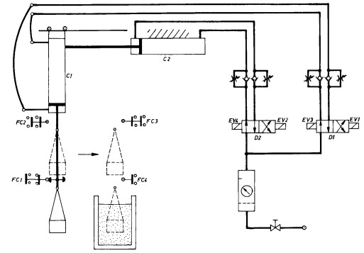

# Variante 46. Limpieza química de piezas

> Páginas 48–49 del PDF original (variante 47 en el documento original). Tareas a realizar: [00-tareas-generales.md](00-tareas-generales.md)

## Descripción del proceso

Esquema electroneumático para una instalación destinada a la limpieza química de piezas que se depositan en una cesta o recipiente metálico.

La instalación neumática consta básicamente de dos cilindros cuya misión es la de elevar la cesta, desplazarla e introducirla en el recipiente con líquido. Pasado el tiempo fijado para el tratamiento químico, la cesta se eleva y vuelve al punto de partida.

### Funcionamiento

Al pulsar en M, se excita EV1, con lo que el distribuidor D1 manda al cilindro C1 subir.

Al llegar la cesta al nivel alto, acciona FC2, alimentándose la electroválvula EV2 que a través de D2 manda desplazar a cesta al cilindro C2 hasta que llega a FC3. En este momento se excita EV3, iniciando C1 el descenso de la cesta.

El recorrido completo de ida se completa cuando la cesta acciona FC4. En este momento inicia la cuenta el temporizador T. Transcurrido el tiempo previsto para el tratamiento, T conecta su contacto temporizado y alimenta EV1, con lo que sube la cesta.

Cuando llega a FC3, se conecta EV4 y la cesta se desplaza. Al llegar a FC2, se conecta EV3 que manda descender la cesta, completándose el ciclo cuando la cesta llega a FC1.

Mientras se realiza el ciclo, la marcha M queda bloqueada. Cada vez que se pulsa en M, se realiza un ciclo completo.

## Elementos

El circuito neumático consta de:

- Cilindros neumáticos de doble efecto: C1 y C2.
- Distribuidores de 2p y 4v, biestables, con accionamiento por electroválvula en los dos sentidos: D1 y D2.
- Reguladores de caudal para todos los sentidos de desplazamiento.
- Conjunto de regulación del circuito: filtro, manorreductor y engrasador.

El circuito eléctrico consta de:

- Pulsador de marcha: M
- Finales de carrera: FC
- Temporizador: T

## Requisitos adicionales

Agregar motobombas.
