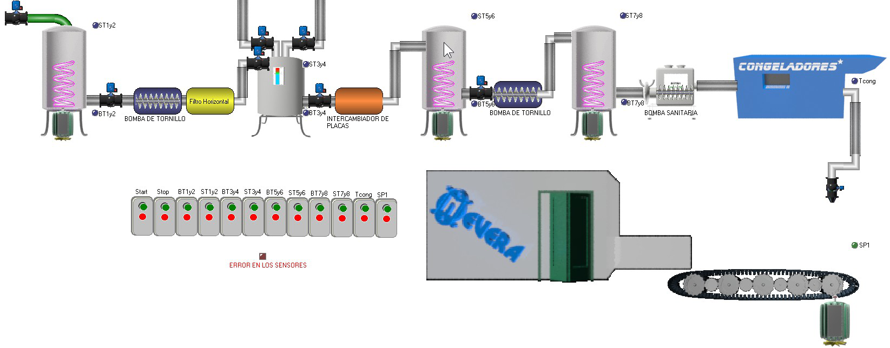

# Variante 47. Fábrica de helados

> Tareas a realizar: [00-tareas-generales.md](00-tareas-generales.md)

## Descripción del proceso

En el flujo tecnológico de esta fábrica se atraviesa por diferentes elementos antes de que la mezcla se convierta en helado y se puede dividir en diferentes etapas para su mejor comprensión: una primera etapa donde se realiza la comprobación y aceptación de las materias primas. En la segunda se realiza la pasteurización y homogeneización de la mezcla, pasando posteriormente a la tercera donde se envejece el helado durante 4 horas como mínimo; la cuarta etapa transcurre cuando se congela y luego se envasa el helado a su recipiente de comercialización y de aquí se envía a la cámara fría hasta que sea retirado de la fábrica.

### Primera etapa

Como es conocido, en toda planta el punto de partida es siempre la materia prima que llega a la fábrica por medio de camiones; la mayor parte de estas materias primas como la leche, emulsificantes y saborizantes son importadas; las mismas, al llegar a la fábrica, son analizadas por el departamento de control de la calidad, donde se da el resultado de apto o no para el consumo. En este caso se le da gran importancia a esta parte, pues la materia prima puede variar en dependencia del tipo y sabor de helado.

### Segunda etapa

Estas materias primas previamente autorizadas y estandarizadas se vierten en los tanques mezcladores-pasteurizadores existentes en la planta, en los cuales se mezclan todos los ingredientes y se cocinan para eliminar los microorganismos patógenos que puedan estar presentes en los mismos. Estos ingredientes se añaden en orden de los menos solubles a los más solubles; la pasteurización se realiza por la circulación del vapor a través de un serpentín y la temperatura a alcanzar es de 84 a 85 ºC, en la cual debe permanecer la mezcla entre 15 y 20 min. Seguidamente es succionada por el homogeneizador, pasando inicialmente por el filtro horizontal donde quedan retenidas todas las partículas extrañas mayores de 1,18 mm que puedan estar presentes como palitos, hilos, grumos.

La homogeneización se realiza a una temperatura de 63 a 71 ºC aproximadamente, con el objetivo de romper o fraccionar los glóbulos de grasa a un diámetro menor de 2 micras y lograr que estas, por su insignificante peso, queden suspendidas en el seno de la mezcla formándose así la emulsión deseada.

En esta etapa se regula mediante dos válvulas de estrangulación la presión de homogeneización, la cual es una función inversa del % de grasa presente en el tipo de mezcla. Posteriormente se refresca la mezcla a una temperatura de 34 a 36 ºC en un intercambiador de placas para lo cual se utiliza agua en flujo a contracorriente de 27 a 30 ºC y luego se enfría de 2 a 4 ºC en otro intercambiador de placas con agua helada de 0,5 a 1 ºC en flujo a contracorriente.

### Tercera etapa

Esta mezcla proveniente del intercambiador se conserva a la temperatura de 2 a 4 ºC en los tanques de envejecimiento para evitar la rápida proliferación de microorganismos y además para una mayor eficiencia energética en la posterior etapa; aquí debe permanecer durante un tiempo de 4 horas como mínimo para lograr la hidratación de las proteínas, solidificación de los glóbulos de grasas, la combinación del estabilizador con el agua libre en la mezcla y el aumento de la viscosidad.

Los tanques se llenan por separado, uno a uno; una vez que la mezcla ha llegado al límite superior del tanque, un operador manualmente cierra la válvula de entrada al tanque y abre la del otro tanque. Los mismos poseen un agitador para mantener la mezcla homogénea; estos se activan de forma manual una vez que se empieza a envasar la mezcla y no se detienen hasta que se haya vaciado el tanque en su totalidad.

### Cuarta etapa

Para llevar a cabo la etapa de congelación, la mezcla es enviada por una bomba de tornillo sin fin a los tanques alimentadores donde se bate la mezcla de forma manual o mecánica para el suministro a los congeladores existentes de una mezcla homogénea. De estos tanques la mezcla se envía a los congeladores por medio de una bomba sanitaria de acción positiva, la cual tiene instalada en la succión un dispositivo que permite la incorporación de aire. El helado semicongelado debe salir de los congeladores a una temperatura de -4 ºC como mínimo, envasándose en sus respectivos recipientes y luego se envía para las neveras de endurecimiento y conservación a una temperatura de -20 ºC como máximo, culminándose así la etapa del proceso productivo.

Toda fábrica de helado consta de elementos que son básicos para la fabricación de este producto: para mezclar y cocinar la mezcla se encuentran los tanques pasteurizadores-mezcladores; con el objetivo de eliminar bacterias y terminar de cocinar la mezcla se colocan los pasteurizadores; los filtros son parte importante de esta etapa, para evitar que la mezcla llegue al homogeneizador con partículas extrañas; a través de todo el proceso intervienen bombas sanitarias, evitando así la contaminación de la mezcla al ser trasladada de un lugar a otro. Los tanques de maduración o envejecimiento forman parte importante en la terminación del helado; aquí intervienen agitadores para dar la viscosidad necesaria antes de pasar a los congeladores para su posterior envase.

Durante gran parte del recorrido de la mezcla de helado por los diferentes componentes de la instalación, ésta es sometida a bajas temperaturas gracias al sistema de refrigeración distribuido en la instalación, el cual mueve el refrigerante NH3 (amoníaco) por medio de compresores que trabajan a diferentes presiones.
