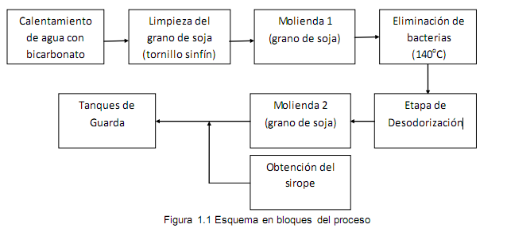
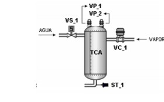
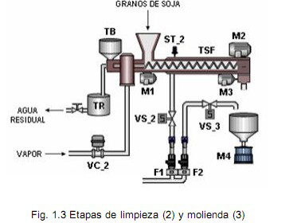
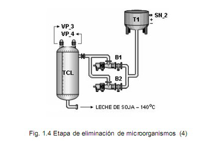
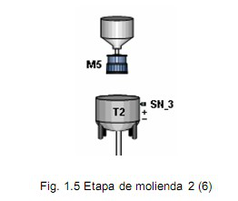
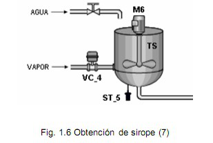
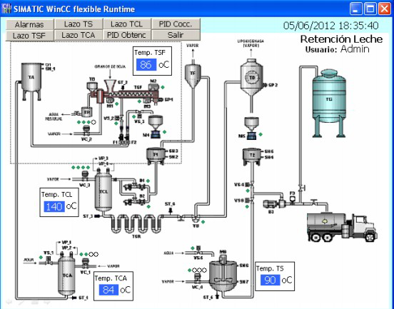

# Variante 48. La pasteurizadora de soja (dos estudiantes)

> Páginas 50–53 del PDF original (variante 50 en el documento original). Tareas a realizar: [00-tareas-generales.md](00-tareas-generales.md)

## 1. Descripción del flujo tecnológico de la obtención y cocción de la leche de soja

El proceso de obtención de la leche de soja más aceptado comienza con el remojo del grano en agua. Pueden variar las temperaturas del agua de remojo, tiempos de retención, adición de bicarbonatos u otros productos químicos, y en algunos casos pre-tratamiento mecánico para la remoción de la cáscara residual. Una vez ablandado el grano, éste es sometido a trituración-molienda para la liberación de las proteínas entrampadas en la malla fibrosa del grano y quedan flotando en una lechada las fibras, algunos carbohidratos, proteínas, aceites, minerales y vitaminas. En esta parte, junto con la adición de agua caliente y/o vapor de agua, se produce la emulsión que apropiadamente puede recibir el nombre de leche.

Primeramente se realiza un proceso de calentamiento de agua, a la cual se le añade una solución de bicarbonato de sodio antes de dosificar en un tornillo sinfín los granos de soja (figura 1.2). Dicha solución, además de ayudar en el reblandecimiento del grano y la extracción de nutrientes, influye en el blanqueo del producto final. Su escasez aumenta la acidez en la leche obtenida, provocando una coagulación y finalmente su deterioro.

Luego se procede a dosificar los granos de soja en el tornillo sinfín para el transporte del cotiledón (grano de soja limpio) y su acondicionamiento previo para la primera etapa de molinado (figura 1.3). El agua que inicialmente se le suministra al tornillo sinfín en la etapa precedente pasa por un tanque calefactor para mantener la temperatura a 85 ºC.

El cotiledón, al hidratarse, libera la cáscara residual que se encuentra adherida a él, y ésta es eliminada por el agua que fluye a contracorriente dentro del tornillo sinfín. El flujo de agua contracorriente se realiza con el objetivo de eliminar las cáscaras que se desprenden de los cotiledones y de algunos carbohidratos indeseables. Éstas son eliminadas por la parte trasera del tornillo sinfín; dicha cáscara es recepcionada en un tanque filtrador.

Una vez hidratado y reblandecido el grano en el tornillo sinfín, éste pasa a una etapa de molinado, a la cual también se le suministra agua caliente a 85 ºC (etapa 3). Esta temperatura ayuda al proceso de molinado a obtener una mezcla líquida emulsionada (leche de soja). El flujo de agua caliente que se le suministra al molino es fundamental para evitar que la leche de soja se obtenga baja de sólidos.

Luego de la obtención de la leche, el fluido es bombeado a un tanque calefactor para un proceso de cocción, donde la temperatura se eleva desde los 85 ºC hasta 140 ºC, con el objetivo de eliminar los inhibidores de tripsina (figura 1.4). Esta temperatura destruye todos los microorganismos patógenos, es decir, la leche saldrá prácticamente estéril.

Una vez que el fluido alcance la temperatura establecida, se dirige a una retención por un tubo serpentín de acero inoxidable donde se inactivan todos los factores antinutricionales y se completa el ablandamiento de las partículas en suspensión.

El tubo serpentín debe estar bien aislado para evitar pérdidas de calor al ambiente y que el producto salga a una temperatura no menor de 135 ºC. La válvula de retención del fluido tiene que estar regulada correctamente para evitar el flasheo interno en el tubo serpentín.

En caso de que la temperatura sea la requerida, la válvula diversora deja circular la leche hacia un tanque desodorizador (etapa de desodorización), en el cual se eliminan todos los vapores condensados en exceso y conjuntamente los componentes volátiles, los cuales aportan los aromas y sabores desagradables a la leche de soja.

Cuando la leche de soja ha sufrido una serie de acondicionamientos, esterilización y desodorización, se realiza una segunda etapa de molinado, donde se logra una desintegración completa de las partículas insolubles de la leche (figura 1.5), de manera que al final del proceso se obtenga un líquido sin la presencia de partículas que sedimenten, logrando por consiguiente una textura agradable. Luego se comienza a bombear el fluido hacia los tanques de guarda donde se inspecciona adecuadamente, determinándose la densidad, sólidos netos, acidez, y se estandariza si es necesario.

Paralelamente a la molienda, se realiza un proceso de homogenización de la leche de soja. Primeramente se suministra agua y una proporción de azúcar en un tanque de sirope, a una temperatura de 90 ºC para obtener la solución de sirope deseada (figura 1.6).

La leche de soja obtenida es mezclada con el sirope y se bombea esta solución hacia los tanques de guarda. El diagrama de flujo de todo el proceso se puede observar detalladamente en el anexo 1.
