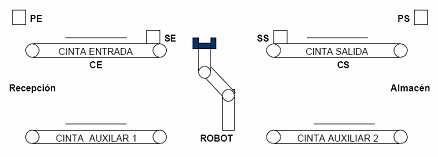

# Variante 49. Almacén

> Páginas 53–54 del PDF original (variante 51 en el documento original). Tareas a realizar: [00-tareas-generales.md](00-tareas-generales.md)

## Descripción del proceso

Se desea controlar de forma automática la entrada y salida de productos en un almacén, utilizando cintas transportadoras y un robot (para desplazar los productos de una cinta a otra), como se muestra en la figura.

El número máximo de piezas que puede haber en el almacén es de 8. Asimismo, es necesario controlar que el almacén esté vacío o que esté lleno. El funcionamiento del almacén es como sigue:

- Cuando se desea almacenar una pieza, el operario la coloca sobre la cinta de entrada y pulsa el botón de entrada (PE). En ese momento la pieza debe ser transportada sobre la cinta (CE) hasta llegar al final de la misma (SE). Si el almacén está lleno, la pieza permanecerá en dicha posición hasta que se saque alguna pieza del mismo. Cuando haya sitio, el robot deberá recogerla y depositarla en la cinta auxiliar 2. Para ello, será necesario activar la señal RE, de modo que el robot se acerque a la posición de entrada, y esperar 30 segundos para que el robot complete el movimiento.
- Del mismo modo, cuando se desee sacar una pieza se pulsará el botón de salida (PS). Si no hay piezas, la petición será ignorada. En caso contrario la pieza se desplazará sobre la cinta de salida hasta la posición SS y esperará allí para ser trasladada por el robot a la cinta auxiliar 1. Para dicho traslado será necesario activar la señal RS y esperar 30 segundos para completar el movimiento.
- La cinta de entrada se pone en marcha/paro con la señal (CE), y la salida con (CS).
- Las cintas auxiliares están siempre en funcionamiento. Se dispone de temporizador de 30 segundos.
- El robot sólo puede atender una petición a la vez, por lo que no se deben activar simultáneamente las señales RE y RS.
- Se dará prioridad a la salida de piezas frente a la llegada.
