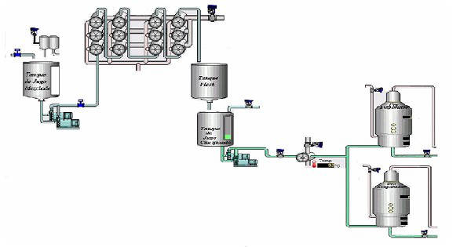

# Variante 50. Área de purificación

> Tareas a realizar: [00-tareas-generales.md](00-tareas-generales.md)

## Descripción del proceso

El área de purificación tiene por objetivo fundamental alcanzar la mayor separación posible de impurezas presentes en el jugo extraído, al menor costo posible y con el mínimo de las pérdidas de azúcar. En esta área se hará el modelo en redes de Petri para mejorar la automatización de los procesos de alcalización, calentamiento y evaporación, que de cierta forma influyen en la eliminación de los sólidos en suspensión y otros disueltos no deseables en el jugo.

En aras de lograr una mejor clarificación, el jugo proveniente del tándem es alcalizado en el tanque de jugo alcalizado, mediante la adición conveniente de lechada de cal para disminuir su acidez y evitar la inversión de la sacarosa. Luego se bombea el jugo alcalizado a los calentadores; el jugo es calentado hasta valores entre 103 °C y 105 °C. Todo esto se realiza con el objetivo de obtener un jugo claro y con una acidez, a la salida del clarificador, en los alrededores de la neutralidad (pH = 7).

El jugo ya calentado y clarificado pasa al tanque de jugo clarificado y luego se envía al pre-evaporador, donde comienza el proceso de concentración en los pre-evaporadores.

