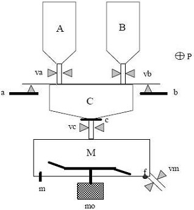

# Variante 52. Mezclador

> Tareas a realizar: [00-tareas-generales.md](00-tareas-generales.md)

## Descripción del proceso

Una instalación mezcladora que tiene dos depósitos los cuales contienen dos productos A y B que se vacían alternadamente sobre un recipiente C que hace de báscula; así podemos seleccionar la cantidad de cada uno de los productos que pasará a mezclarse.

El mezclador M permite obtener la mezcla formada por estos dos productos gracias a la rotación de una hélice.

La orden de inicio la dará un operario apretando un pulsador P siempre y cuando las condiciones iniciales sean ciertas (C y M vacíos).

Entonces, pesamos la cantidad de producto A (abriendo la válvula va) en C hasta llegar al peso deseado, dato obtenido mediante el sensor a, e inmediatamente es volcada al mezclador a través de la válvula vc hasta que el recipiente C quede vacío (dato obtenido con el sensor c).

De igual manera, pesamos la cantidad de producto B (abriendo la válvula vb) en C hasta llegar al peso deseado, dato obtenido mediante el sensor c, e inmediatamente es volcada al mezclador a través de la válvula vc hasta que el recipiente C quede vacío (dato obtenido con el sensor c).

Seguidamente se activa el motor de la hélice (mo); el producto A y el producto B son mezclados hasta llegar al nivel de mezcla deseado, indicado por el sensor m.

Finalmente vaciaremos el contenido del mezclador M a través de la válvula vm hasta que éste quede vacío, indicado por el sensor f.
