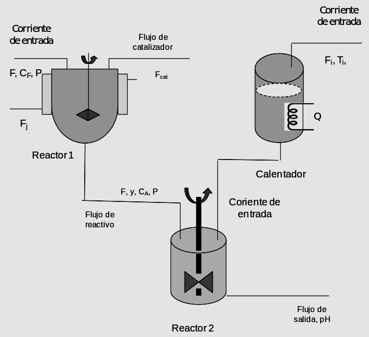

# Variante 53. Planta de control de pH

> Páginas 56–57 del PDF original (variante 55 en el documento original). Tareas a realizar: [00-tareas-generales.md](00-tareas-generales.md)

## Esquema del proceso

## Condiciones de operación

Se trata de una planta compuesta por dos reactores y un calentador. La función del calentador es garantizar una temperatura adecuada de la corriente de entrada al segundo reactor, que es donde se controla su pH. La función del primer reactor es depurar los efectos de las impurezas del catalizador en el mismo y que puedan afectar la operación del segundo reactor al usar un reactivo impuro.

En el segundo reactor se alimenta la corriente cuyo pH se desea estabilizar y el reactivo proveniente del primer reactor. El primer reactor está provisto de una chaqueta y corriente de calentamiento o enfriamiento Fj, pero en este caso no la vamos a considerar.

En la planta se desea mantener la temperatura del líquido en 150 ºF, la composición del reactivo del primer reactor en el 60 % y el pH en 7.

## Objetivos de la planta

Mantener regulado el pH a la salida del reactor 2, para lo cual se precisa regular la temperatura de salida del calentador y la concentración del reactivo a la salida del primer reactor.

## Modelado y datos de la planta

- La temperatura de saturación Tvs = 242 ºF.
- La temperatura deseada a la salida del intercambiador debe ser Ts = 150 ºF.
