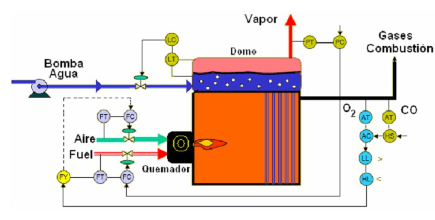
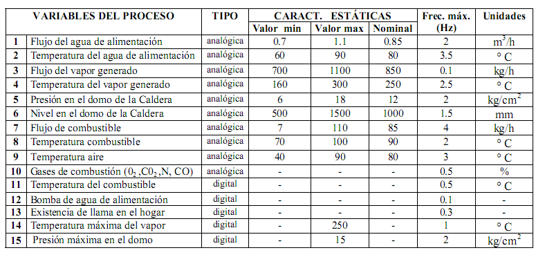

# Variante 54. Caldera de vapor

> Página 57 del PDF original (variante 56 en el documento original). Tareas a realizar: [00-tareas-generales.md](00-tareas-generales.md)

## Variables del proceso

| # | Variable del proceso | Tipo | Valor mín. | Valor máx. | Nominal | Frec. máx. (Hz) | Unidades |
|---|---|---|---|---|---|---|---|
| 1 | Flujo del agua de alimentación | analógica | 0.7 | 1.1 | 0.85 | 2 | m³/h |
| 2 | Temperatura del agua de alimentación | analógica | 60 | 90 | 80 | 3.5 | °C |
| 3 | Flujo del vapor generado | analógica | 700 | 1100 | 850 | 0.1 | kg/h |
| 4 | Temperatura del vapor generado | analógica | 160 | 300 | 250 | 2.5 | °C |
| 5 | Presión en el domo de la caldera | analógica | 6 | 18 | 12 | 2 | kg/cm² |
| 6 | Nivel en el domo de la caldera | analógica | 500 | 1500 | 1000 | 1.5 | mm |
| 7 | Flujo de combustible | analógica | 7 | 110 | 85 | 4 | kg/h |
| 8 | Temperatura combustible | analógica | 70 | 100 | 90 | 2 | °C |
| 9 | Temperatura aire | analógica | 40 | 90 | 80 | 3 | °C |
| 10 | Gases de combustión (O2, CO2, N, CO) | analógica | – | – | – | 0.5 | % |
| 11 | Temperatura del combustible | digital | – | – | – | 0.5 | °C |
| 12 | Bomba de agua de alimentación | digital | – | – | – | 0.1 | – |
| 13 | Existencia de llama en el hogar | digital | – | – | – | 0.3 | – |
| 14 | Temperatura máxima del vapor | digital | – | 250 | – | 1 | °C |
| 15 | Presión máxima en el domo | digital | – | 15 | – | 2 | kg/cm² |

## Requisitos adicionales

Seleccionar sistema de mando para el motor de la bomba y elegir límites para las variables analógicas, mantener una.
